# 12 SAML 2.0 Federation HLD

This document defines the SAML 2.0 federation design for Tikti operating in Service Provider mode. It is an additive, feature-specific high-level design that complements the core platform specification under `docs/00_index.md`.

## 1. Context

Tikti is a headless multi-tenant IdP written in Go. It authenticates callers against its own credential store, issues an HS256 idToken, and exchanges that idToken for an RS256 access token. Tenant isolation rests on the `tid` claim; relying parties verify access tokens offline via JWKS. Enterprise buyers require SAML 2.0 to reuse their corporate identity provider (Azure AD, Okta, Ping, ADFS, Google Workspace, OneLogin). Without SAML, Tikti cannot enter 6 of 10 deals in the current pipeline and forces duplicated user provisioning.

This design adds the SAML 2.0 Web Browser SSO Profile with Tikti in the Service Provider (SP) role, delegating authentication to 1..N external Identity Providers with one binding per tenant. A successful SAML flow produces the same HS256 idToken that the password path issues today, so every downstream path (token exchange, `tid` enforcement, JWKS consumers) continues to work with zero code changes.

## 2. Scope

**In scope (v1).** This design delivers login to Tikti via any SAML 2.0 IdP: Azure AD / Entra ID, Okta, Ping, ADFS, Google Workspace (administered at `admin.google.com` -> Apps -> Web and mobile apps -> SAML app), OneLogin, JumpCloud, Auth0 acting as SAML IdP, Shibboleth, Keycloak, and SimpleSAMLphp. The scope covers SP-initiated SSO (Tikti -> IdP -> Tikti), Single Logout (SP-initiated round-trip and IdP-initiated receive), signed `AuthnRequest` messages, signed and optionally encrypted assertions, per-tenant IdP metadata and trust pinning, attribute mapping to the Tikti user model and `tid`, Just-In-Time provisioning, HS256 idToken issuance preserving the existing token-exchange contract, an admin CLI for metadata and key lifecycle, Helm values for SP keys, Prometheus metrics, and a structured audit log.

**Out of scope (v1).** Consumer OIDC buttons ("Sign in with Google" for `@gmail.com` personal accounts, "Sign in with Apple", "Sign in with Microsoft" personal) speak OIDC, not SAML, and land on a separate roadmap item (OIDC federation, v2). IdP-initiated SSO without `InResponseTo` is deferred to v1.1 when the hardened validator ships. SCIM provisioning is deferred to v2; login works without it. SAML ECP, WS-Fed, HTTP-Artifact binding, and SAML 1.1 inbound are legacy profiles with no demand in the current pipeline. Tikti acting as a SAML IdP for third-party SPs is the inverse direction and a separate product.

> **Reading note.** "OIDC federation" in this document means _adding OIDC as a second federation protocol alongside SAML_. It does **not** mean blocking Google. Any Google Workspace tenant authenticates via the SAML path described above in v1. The consumer "Sign in with Google" button (personal `gmail.com` accounts, OAuth consent screen) is the v2 item.

## 3. Goals and Non-Goals

The design targets one shared SP entity with N tenant-scoped IdP trust relationships, zero changes to relying parties that verify RS256 tokens, assertion-to-idToken latency at P95 below 150 ms (excluding IdP redirect time), key rotation with zero failed requests, and one audit record per assertion decision.

Non-goals include building a SAML IdP, supporting SAML 1.1, supporting unsigned assertions, supporting HTTP-Artifact binding, and replacing the existing password flow.

## 4. Current State (as inferred)

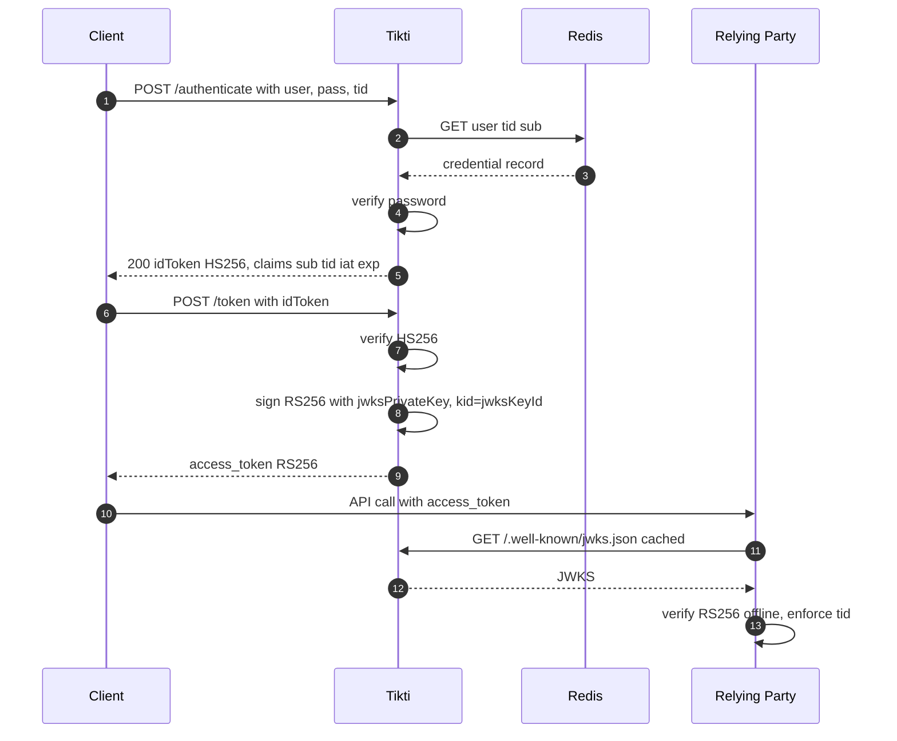

## 5. Target State

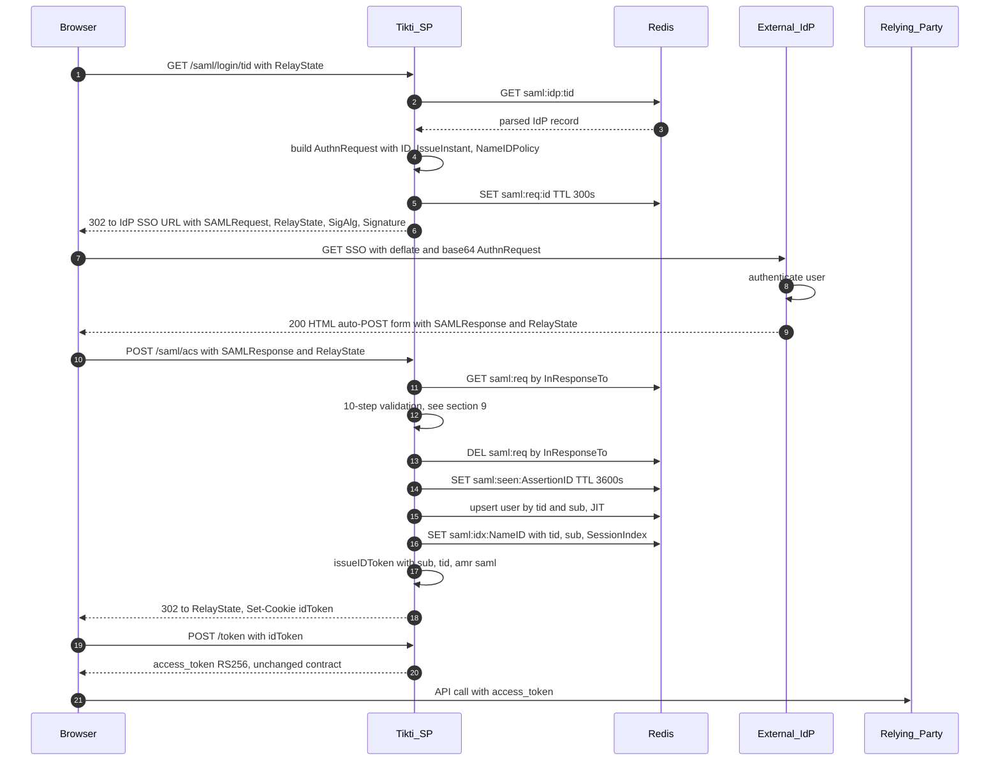

## 6. Architecture Overview

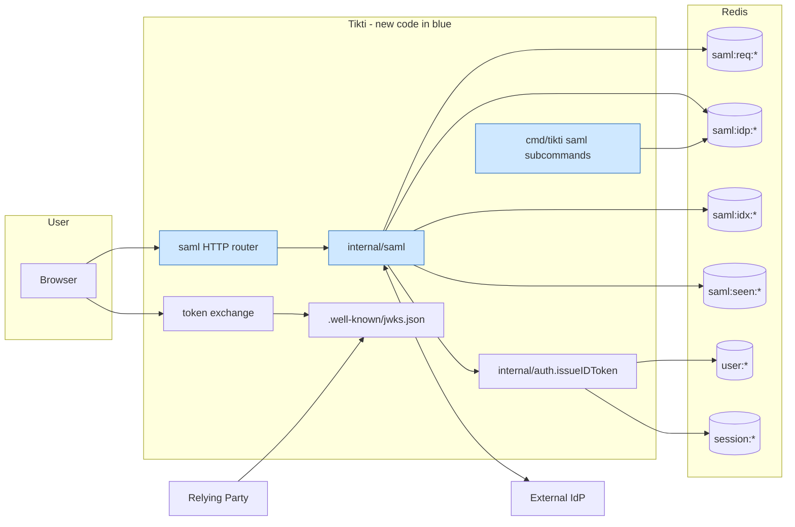

Only blue boxes represent new code. `internal/auth.issueIDToken` is an existing function **`[verify against repo]`**; this design calls it from the SAML handler instead of the password handler.

## 7. Actors and Trust Model

Three actors participate in the federation: the User Agent (browser), Tikti (SP), and the External IdP. Trust is asymmetric and scoped per tenant: Tikti trusts IdP X for tenant A and IdP Y for tenant B, with no default trust. The trust material is the IdP signing certificate extracted from IdP metadata and pinned at registration time. SP signing and decryption keys are tenant-agnostic in v1 (one SP entity, one RSA key pair) to keep the cryptographic surface area constrained. Per-tenant SP keys are deferred to v2 without a schema break (see section 28).

## 8. Endpoints and Bindings

|Path|Method|Binding|Purpose|
|---|---|---|---|
|`/saml/metadata`|GET|n/a|Emit SP `EntityDescriptor` XML|
|`/saml/login/{tid}`|GET|HTTP-Redirect|Build and emit signed `AuthnRequest`|
|`/saml/acs`|POST|HTTP-POST|Consume signed Response, issue idToken|
|`/saml/logout/{tid}`|GET|HTTP-Redirect|Build signed `LogoutRequest`|
|`/saml/slo`|GET, POST|HTTP-Redirect (resp), HTTP-POST (req)|Consume IdP's logout response or IdP-initiated logout request|
|`/saml/discover`|GET|n/a|Email-domain -> `tid` lookup for browser hint|

Entity ID: `{issuerBaseUrl}/saml`. ACS: `{issuerBaseUrl}/saml/acs`. SLO: `{issuerBaseUrl}/saml/slo`.

## 9. Flow - SP-Initiated SSO

### 9.1 AuthnRequest construction

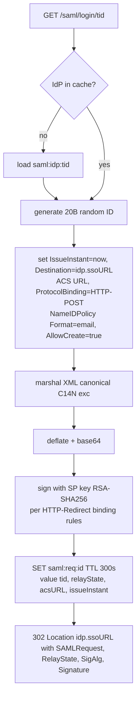

### 9.2 Response validation (10 steps, first failure wins)

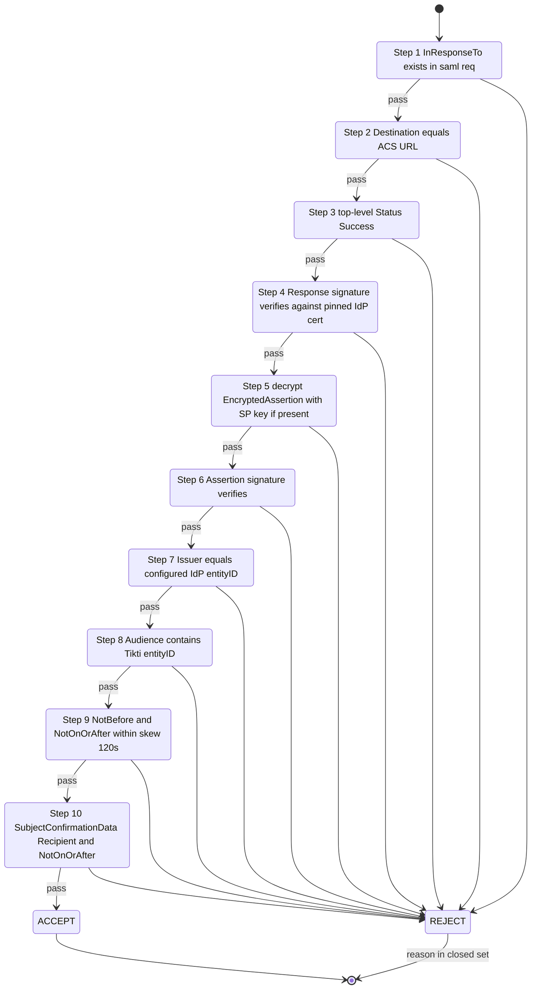

After ACCEPT the handler deletes `saml:req:{InResponseTo}`, writes `saml:seen:{AssertionID}` with TTL 3600 s, maps attributes, JIT-provisions the user, writes `saml:idx:{NameID}`, and calls `auth.issueIDToken`.

## 10. Attribute Mapping and JIT Provisioning

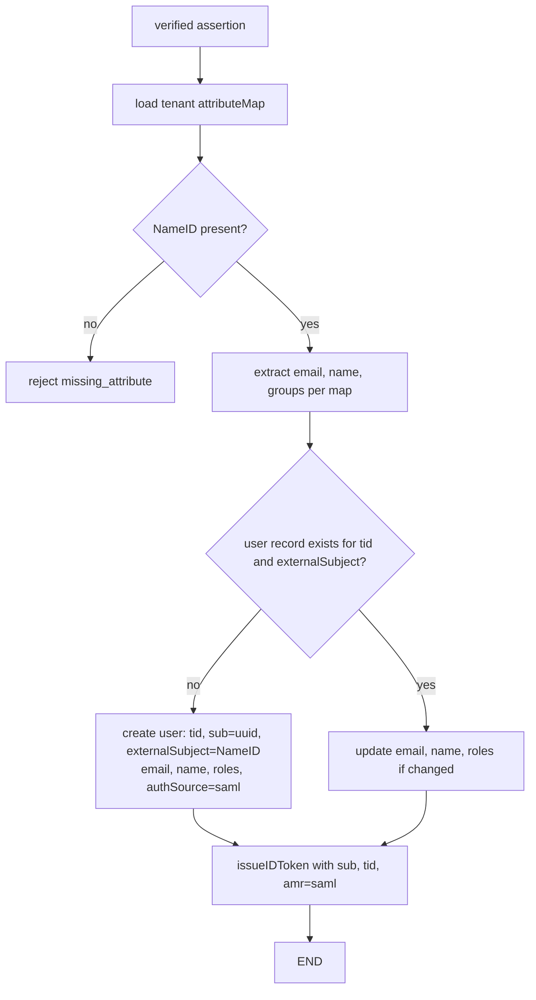

The `tid` value is taken from the URL path, never from the assertion, to prevent tenant escalation through a compromised IdP. The default attribute map for each IdP record is:

```yaml
attributeMap:
  subject: NameID
  email: ["mail", "http://schemas.xmlsoap.org/ws/2005/05/identity/claims/emailaddress"]
  name:  ["displayName", "http://schemas.xmlsoap.org/ws/2005/05/identity/claims/name"]
  roles: ["groups", "http://schemas.microsoft.com/ws/2008/06/identity/claims/groups"]
```

## 11. Session Issuance - Bridging SAML to Tikti's Existing Model

The ACS handler calls `auth.issueIDToken(ctx, user, tid, amr=["saml"])` **`[verify against repo]`**. No SAML-specific claims appear in the idToken beyond `amr`. The RS256 access token produced by the existing exchange endpoint is identical in shape to the password-issued path except for `amr`. Relying parties that ignore `amr` are unaffected.

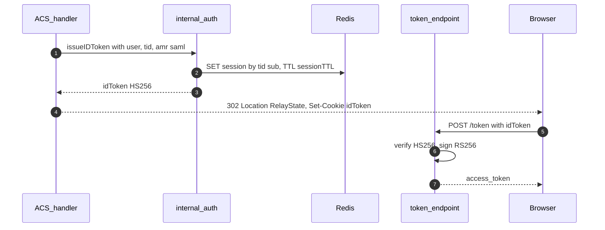

## 12. Single Logout

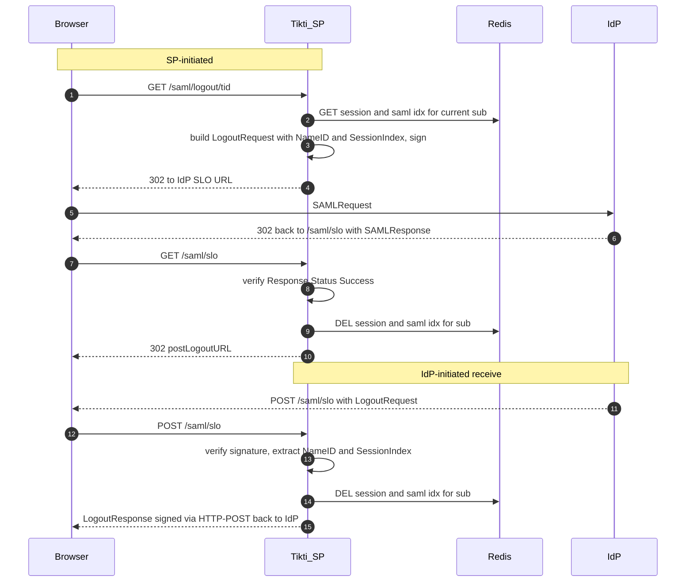

## 13. Cryptography and Key Management

All signatures use RSASSA-PKCS1-v1_5 with SHA-256 (`rsa-sha256`) and a SHA-256 digest over Exclusive C14N (`xml-exc-c14n`) canonicalization. Assertion encryption uses AES-256-GCM for the content and RSA-OAEP with SHA-256 for key transport.

SP keys are 2048-bit RSA (3072-bit supported via `saml.sp.keyBits=3072`). The process loads keys once at startup from disk, holds them in memory, and never writes them to Redis. Key rotation follows a two-step procedure:

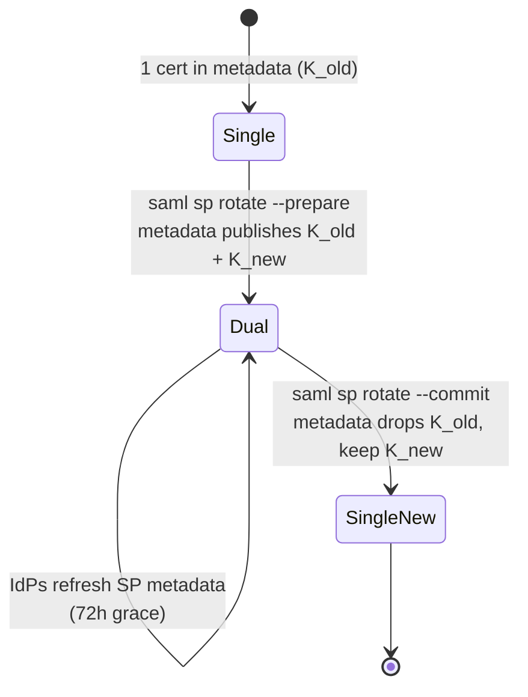

IdP certificate rotation: `saml idp update --tid X --metadata-url ...`. Tikti accepts both old and new certificates for a 24-hour overlap, then prunes the old one.

## 14. Multi-Tenant IdP Routing

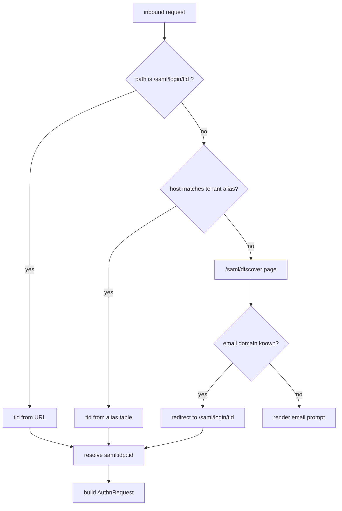

## 15. Data Model

### 15.1 Redis keyspace (new keys in blue)

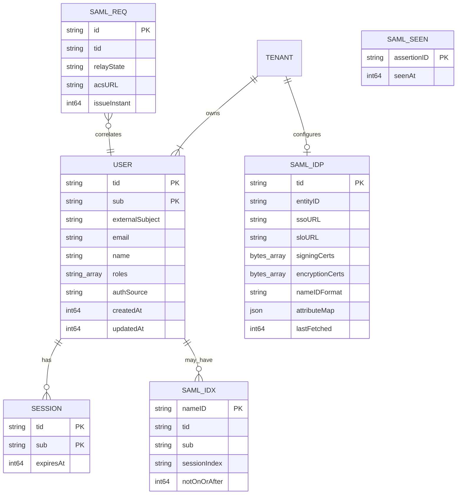

### 15.2 Key formats and TTLs

|Key pattern|Value|TTL|Access|
|---|---|---|---|
|`saml:req:{id}`|msgpack of request record|300 s|write once, read once|
|`saml:idp:{tid}`|msgpack of IdP record|none (refresh on configured interval)|read-heavy; writes via CLI or protected admin API|
|`saml:idx:{nameID}`|msgpack of session link|`notOnOrAfter` bounded|write on ACS, delete on SLO|
|`saml:seen:{assertionID}`|`1`|3600 s|replay guard|

Values are msgpack-encoded, reducing payload size by 30% compared to JSON. The library is `github.com/vmihailenco/msgpack/v5`.

### 15.3 User record migration

Two fields are added to the user record: `authSource` (enum `password|saml`, default `password`) and `externalSubject` (string, default `""`). The migration tool adds both fields with their defaults. The field list lives in `internal/user/model.go` **`[verify against repo]`**.

## 16. Configuration Surface

Additions to `config/tikti.yaml`:

```yaml
saml:
  enabled: true
  sp:
    entityID: "${issuerBaseUrl}/saml"
    acsURL: "${issuerBaseUrl}/saml/acs"
    sloURL: "${issuerBaseUrl}/saml/slo"
    signingKeyPath: "/etc/tikti/saml/sp.key"
    signingCertPath: "/etc/tikti/saml/sp.crt"
    encryptionKeyPath: "/etc/tikti/saml/sp.key"
    encryptionCertPath: "/etc/tikti/saml/sp.crt"
    keyBits: 2048
    clockSkewSeconds: 120
    requestTTLSeconds: 300
    allowedSigAlgs: ["rsa-sha256"]
    allowedDigestAlgs: ["sha256"]
    canonicalization: "xml-exc-c14n"
    requireAssertionSigned: true
    requireEncryptedAssertion: false
  acs:
    postLoginURL: "/dashboard"
    deliveryMode: "cookie"          # cookie | fragment | form-post
    cookieName: "tikti_idt"
    cookieSameSite: "Lax"           # Lax keeps POST-back SAML flow working
    cookieSecure: true
    cookieHTTPOnly: true
  idp:
    refreshIntervalHours: 24
    backgroundRefresh: true
  discover:
    enabled: true
    emailDomainIndexKey: "saml:discover:domain"
  metrics:
    namespace: "tikti"
    subsystem: "saml"
```

Per-tenant IdP records are not stored in YAML. They reside in Redis and are managed through the CLI or the protected Code Admin control plane. This separation keeps YAML static at deploy time and the trust table mutable at runtime.

## 17. Admin CLI Additions

```text
tikti saml sp metadata [--out FILE]
tikti saml sp rotate {--prepare | --commit}
tikti saml idp register --tid TID --metadata-url URL [--attr-map FILE]
tikti saml idp update --tid TID [--metadata-url URL] [--attr-map FILE]
tikti saml idp remove --tid TID
tikti saml idp list [--tid TID]
tikti saml idp show --tid TID [--json]
tikti saml idp fetch --tid TID          # force metadata refresh
tikti saml test --tid TID --email USER  # emits AuthnRequest URL for manual validation
tikti saml domain add --tid TID --domain EXAMPLE.COM
tikti saml domain remove --domain EXAMPLE.COM
```

## 18. Observability

**Counters:** `tikti_saml_authn_requests_total{tid}`, `tikti_saml_responses_total{tid,result}`, `tikti_saml_validation_failures_total{tid,reason}`, `tikti_saml_jit_provisions_total{tid}`, `tikti_saml_logout_requests_total{tid}`, `tikti_saml_logout_responses_total{tid,result}`, `tikti_saml_metadata_refresh_total{tid,result}`, `tikti_saml_replay_blocked_total{tid}`, `tikti_saml_idp_admin_changes_total{operation,result}`, `tikti_saml_state_cookie_recovery_total{result}` where `result` is one of `repost`, `success`, or `failure`.

**Histograms:** `tikti_saml_response_validation_duration_seconds{tid}` (buckets: .005, .01, .025, .05, .1, .25, .5, 1), `tikti_saml_idp_roundtrip_duration_seconds{tid}`.

**Gauges:** `tikti_saml_idp_cert_expiry_seconds{tid,subject}`, `tikti_saml_sp_cert_expiry_seconds`.

**Audit log:** Each assertion decision emits one record with schema `{event:"saml.assertion", tid, requestID, nameID, issuer, decision:"accept|reject", reason, durationMs, ts}`. The sink is the existing Tikti audit writer **`[verify against repo]`**.

**Tracing:** Each inbound request creates one span carrying attributes `saml.tid`, `saml.issuer`, `saml.request_id`, and `saml.result`.

## 19. Error Taxonomy (closed set)

```text
request_not_found            request_replay
destination_mismatch         issuer_mismatch
status_not_success           audience_mismatch
signature_invalid            decrypt_failed
assertion_signature_invalid  clock_skew
subject_confirmation_mismatch
missing_attribute            tid_unknown
idp_metadata_stale           algorithm_disallowed
xxe_detected                 signature_wrapping_detected
internal_error
```

Internal reasons are logged server-side. The user-facing page renders one of four neutral messages to prevent oracle behavior.

## 20. Security Controls

Replay protection operates at two layers. The `InResponseTo` value must exist in `saml:req:{id}`, and the record is deleted on first use. Independently, `saml:seen:{assertionID}` blocks duplicate assertions for 3600 s regardless of request correlation.

Signature wrapping defense validates every signature `Reference` URI against `ID` attributes under the signed `Assertion` element using the ancestor-walk algorithm. The validator rejects unresolved references and rejects extra signed elements outside the asserted scope.

XXE prevention disables DTD parsing and external entities. The XML parser uses `encoding/xml` with `Strict=true` and a custom `xml.Decoder` that rejects `!DOCTYPE` declarations.

The algorithm allowlist rejects `rsa-sha1`, `sha1`, `xml-c14n` (non-exclusive), `des-*`, `md5`, and unsigned assertions.

Request TTL is 300 s. Clock skew tolerance is 120 s. The maximum window from `AuthnRequest` to accepted Response is 420 s.

Transport security enforces HTTPS at ingress. The idToken cookie carries `SameSite=Lax` (required for the IdP's POST-back to carry the cookie on the first-party redirect chain), `HttpOnly=true`, and `Secure=true`.

CSRF protection on the ACS endpoint relies on the `InResponseTo` and signature chain in place of a traditional CSRF token, since the POST contains a cryptographically bound correlation. A state cookie is additionally set at `/saml/login/{tid}` and checked at `/saml/acs` to bind the response to the initiating browser and defend against login CSRF and cross-tenant submission. If browser privacy controls omit the state cookie on the cross-site IdP POST, Tikti returns a cache-disabled page that reposts once to the same ACS origin. The repost must carry the original state cookie; otherwise Tikti rejects it without validating or issuing a session.

Session binding ties the idToken cookie to `tid` via the path `/` and rotates the cookie on every successful SAML login.

## 21. Library Choice

`github.com/crewjam/saml` is the Go SAML library with the highest production deployment count in public datasets and an active commit history. It supports HTTP-Redirect and HTTP-POST bindings, assertion encryption, signed `AuthnRequest`, and SLO. Two alternatives were considered: `github.com/russellhaering/gosaml2` (no SLO, no assertion encryption) and a from-scratch implementation (cost: 8 engineer-weeks plus audit). The decision is to adopt `crewjam/saml` wrapped behind `tiktisaml.Provider` so the dependency remains replaceable.

Transitive dependencies introduced: `github.com/beevik/etree` (XML DOM), `github.com/russellhaering/goxmldsig` (XML-DSig), `github.com/mattermost/xml-roundtrip-validator` (canonicalization safety check).

## 22. Package Layout - Exhaustive File List

```text
tikti/
├── cmd/
│   └── tikti/
│       ├── main.go                        # existing - wire new handlers behind saml.enabled
│       ├── saml_sp_metadata.go            # NEW - CLI: print SP metadata
│       ├── saml_sp_rotate.go              # NEW - CLI: 2-step SP key rotation
│       ├── saml_idp_register.go           # NEW - CLI: add IdP for tenant
│       ├── saml_idp_update.go             # NEW - CLI: refresh IdP record
│       ├── saml_idp_remove.go             # NEW - CLI: revoke IdP
│       ├── saml_idp_list.go               # NEW - CLI: list IdPs
│       ├── saml_idp_show.go               # NEW - CLI: show 1 IdP
│       ├── saml_idp_fetch.go              # NEW - CLI: force metadata refresh
│       ├── saml_test.go                   # NEW - CLI: emit test AuthnRequest
│       ├── saml_domain_add.go             # NEW - CLI: map email domain -> tid
│       └── saml_domain_remove.go          # NEW - CLI: unmap email domain
├── internal/
│   ├── auth/
│   │   ├── token.go                       # existing - issueIDToken(ctx,user,tid,amr)
│   │   └── token_test.go                  # existing + new test for amr=saml
│   ├── config/
│   │   ├── config.go                      # existing - add SAMLConfig struct
│   │   └── config_test.go                 # existing + new cases for saml.*
│   ├── httpapi/
│   │   ├── router.go                      # existing - mount /saml/* group
│   │   └── middleware.go                  # existing - tid extraction helper
│   ├── redis/
│   │   ├── client.go                      # existing - passed to SAML store
│   │   └── keys.go                        # NEW or edit - add saml:* prefixes
│   ├── user/
│   │   ├── model.go                       # existing - add authSource, externalSubject
│   │   ├── store.go                       # existing - add UpsertFromSAML
│   │   └── store_test.go                  # existing + new cases
│   └── saml/                              # NEW package, DIP inward
│       ├── provider.go                    # Provider interface (see section 23)
│       ├── provider_crewjam.go            # crewjam/saml adapter
│       ├── metadata.go                    # SPMetadata(), ParseIdPMetadata()
│       ├── validator.go                   # 10-step Response validation pipeline
│       ├── validator_wrapping.go          # signature wrapping defence
│       ├── attr.go                        # attribute map + JIT
│       ├── session.go                     # SessionBridge: assertion -> idToken
│       ├── store.go                       # Store interface (Redis keyspaces)
│       ├── store_redis.go                 # Redis implementation
│       ├── http.go                        # handlers /saml/*
│       ├── http_login.go                  # GET /saml/login/{tid}
│       ├── http_acs.go                    # POST /saml/acs
│       ├── http_metadata.go               # GET /saml/metadata
│       ├── http_logout.go                 # GET /saml/logout/{tid}
│       ├── http_slo.go                    # GET|POST /saml/slo
│       ├── http_discover.go               # GET /saml/discover
│       ├── clock.go                       # Clock interface for skew tests
│       ├── errors.go                      # closed reason taxonomy
│       ├── metrics.go                     # Prometheus collectors
│       ├── audit.go                       # audit record emission
│       ├── codec.go                       # msgpack encode/decode record types
│       ├── domain.go                      # Provider, Store, Bridge domain types
│       ├── refresh.go                     # background IdP metadata refresher
│       ├── crypto.go                      # XML-DSig + encryption helpers
│       └── testdata/                      # 60 canned SAML Responses
│           ├── azure/
│           ├── okta/
│           ├── ping/
│           ├── adfs/
│           └── google/
├── migrations/
│   └── 0007_saml_user_fields.go           # NEW - migration tool entry
├── charts/tikti/
│   ├── values.yaml                        # existing - add saml.* defaults
│   ├── templates/secret-saml.yaml         # NEW - SP key Secret
│   ├── templates/configmap.yaml           # existing - render saml section
│   └── templates/deployment.yaml          # existing - mount SAML Secret
├── docs/
│   ├── saml/
│   │   ├── overview.md                    # NEW - customer-facing intro
│   │   ├── metadata-ingestion.md          # NEW - how to onboard an IdP
│   │   ├── key-rotation.md                # NEW - 2-step SP rotation
│   │   ├── attribute-mapping.md           # NEW - per-IdP map reference
│   │   ├── troubleshooting.md             # NEW - reason codes explained
│   │   └── idps/
│   │       ├── azure-ad.md                # NEW - tested config
│   │       ├── okta.md                    # NEW
│   │       ├── ping.md                    # NEW
│   │       ├── adfs.md                    # NEW
│   │       └── google.md                  # NEW
└── test/
    ├── integration/
    │   └── saml_e2e_test.go               # NEW - full SSO + SLO loop
    └── load/
        └── saml_acs_bench.go              # NEW - k6 or vegeta script
```

The layout introduces approximately 45 new files and edits approximately 10 existing files. Tests are colocated with the package; integration and load tests are isolated under `test/`.

## 23. Interfaces and Function Signatures

### 23.1 `internal/saml/provider.go`

```go
// Provider abstracts the SAML protocol library. 6 methods, interface
// segregation keeps the dependency replaceable (DIP).
type Provider interface {
    BuildAuthnRequest(ctx context.Context, in BuildAuthnRequestInput) (*AuthnRequest, error)
    ValidateResponse(ctx context.Context, in ValidateResponseInput) (*VerifiedAssertion, error)
    BuildLogoutRequest(ctx context.Context, in BuildLogoutRequestInput) (*LogoutRequest, error)
    ValidateLogoutMessage(ctx context.Context, in ValidateLogoutInput) (*VerifiedLogout, error)
    SPMetadata(ctx context.Context) ([]byte, error)
    ParseIdPMetadata(ctx context.Context, raw []byte) (*IdPRecord, error)
}
```

### 23.2 `internal/saml/domain.go`

```go
type BuildAuthnRequestInput struct {
    TenantID     string
    IdP          IdPRecord
    RelayState   string
    ACSURL       string
    RequestID    string // caller-supplied, 20 random bytes hex
    IssueInstant time.Time
    ForceAuthn   bool
    NameIDFormat string
}

type AuthnRequest struct {
    ID           string
    RedirectURL  string // fully signed, ready to 302
}

type ValidateResponseInput struct {
    TenantID   string
    IdP        IdPRecord
    RawBase64  string
    RelayState string
    Now        time.Time
    ExpectedInResponseTo string
    ClockSkew  time.Duration
}

type VerifiedAssertion struct {
    AssertionID      string
    NameID           string
    NameIDFormat     string
    SessionIndex     string
    NotOnOrAfter     time.Time
    Attributes       map[string][]string
    IssuerEntityID   string
}

type IdPRecord struct {
    TenantID         string
    EntityID         string
    SSOURL           string
    SLOURL           string
    SigningCerts     [][]byte
    EncryptionCerts  [][]byte
    NameIDFormat     string
    AttributeMap     map[string][]string
    LastFetched      time.Time
}
```

### 23.3 `internal/saml/store.go`

```go
type Store interface {
    PutRequest(ctx context.Context, rec RequestRecord) error
    ConsumeRequest(ctx context.Context, id string) (RequestRecord, bool, error)

    PutIdP(ctx context.Context, rec IdPRecord) error
    GetIdP(ctx context.Context, tid string) (IdPRecord, error)
    ListIdPs(ctx context.Context) ([]IdPRecord, error)
    DeleteIdP(ctx context.Context, tid string) error

    PutIndex(ctx context.Context, nameID string, rec IndexRecord) error
    GetIndex(ctx context.Context, nameID string) (IndexRecord, error)
    DeleteIndex(ctx context.Context, nameID string) error

    MarkSeen(ctx context.Context, assertionID string, ttl time.Duration) (bool, error)

    PutDomain(ctx context.Context, domain, tid string) error
    GetDomain(ctx context.Context, domain string) (string, error)
    DeleteDomain(ctx context.Context, domain string) error
}
```

### 23.4 `internal/saml/session.go`

```go
type SessionBridge interface {
    Issue(ctx context.Context, in IssueInput) (idToken string, err error)
}

type IssueInput struct {
    TenantID         string
    Subject          string
    ExternalSubject  string
    Email            string
    Name             string
    Roles            []string
    AMR              []string // ["saml"]
    AuthnInstant     time.Time
}
```

The existing `internal/auth.IssueIDToken` **`[verify against repo]`** is wrapped by a `sessionBridgeAuth` struct implementing `SessionBridge`, enabling unit tests to substitute an in-memory bridge.

### 23.5 `internal/saml/validator.go` - signature shape

```go
func validate(ctx context.Context, prov Provider, store Store, clk Clock,
    tid string, raw, relayState string, cfg SPConfig) (*VerifiedAssertion, Reason, error)
```

Return contract: if `Reason != ReasonOK`, the caller emits the metric and audit record and renders the neutral error page; `error` is reserved for internal failures (Redis, XML parser crash) not for validation rejections.

### 23.6 HTTP handlers, 6 of them

```go
func (h *Handler) Metadata(w http.ResponseWriter, r *http.Request)
func (h *Handler) Login(w http.ResponseWriter, r *http.Request)     // /saml/login/{tid}
func (h *Handler) ACS(w http.ResponseWriter, r *http.Request)       // /saml/acs
func (h *Handler) Logout(w http.ResponseWriter, r *http.Request)    // /saml/logout/{tid}
func (h *Handler) SLO(w http.ResponseWriter, r *http.Request)       // /saml/slo
func (h *Handler) Discover(w http.ResponseWriter, r *http.Request)  // /saml/discover
```

Each handler stays within 80 lines. The `validate` function spans approximately 200 lines with subfunctions per step in `validator.go`.

## 24. Testing Strategy

Unit tests are colocated per file and run via `go test ./internal/saml/...`. Redis is replaced by `github.com/alicebob/miniredis/v2` and the clock is replaced by a fake `Clock` implementation.

Conformance testing uses 60 canned `SAMLResponse` documents: 15 covering the rejection branches from section 19 (one document per reason) and 45 covering accept cases across 9 flavors and 5 IdP vendors (Azure AD, Okta, Ping, ADFS, Google Workspace).

Integration testing runs one end-to-end test that spins up `crewjam/saml`'s reference IdP against the full Tikti process with a `miniredis` backend, exercises SP-SSO and SLO, and asserts both the idToken and the RS256 access token.

Load testing uses a k6 script that emits 500 `POST /saml/acs` requests per second for 5 minutes with pre-generated signed responses. The targets are P95 latency below 150 ms and error rate below 0.01%.

The coverage target for `internal/saml` is 90% line coverage, with 100% branch coverage on all 15 rejection reasons.

Fuzz testing runs `go test -fuzz=FuzzParseResponse` on the XML parser with 1 million iterations in CI on a nightly schedule.

## 25. Rollout Plan

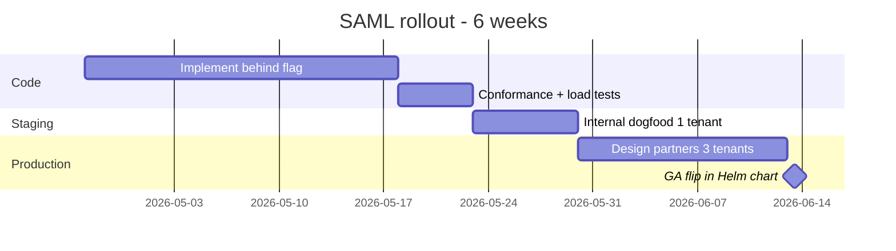

Rollback at any phase consists of setting `saml.enabled=false`. All `/saml/*` routes then return 404, and the password flow remains unchanged.

## 26. Risks and Mitigations

|#|Risk|Likelihood|Impact|Mitigation|
|---|---|---|---|---|
|1|NTP drift across IdPs|60%|H|120 s skew, drift metric + alert at P99 > 60 s|
|2|IdP metadata drift (cert rotation)|40%|H|24 h refresher, alert on 2 consecutive failures|
|3|Signature wrapping attack|5%|C|ancestor-walk validator, penetration test before GA|
|4|Library drift (`crewjam/saml`)|20%|M|`Provider` interface, swap budget <= 5 engineer-days|
|5|Cookie SameSite regressions on browsers|10%|M|`Lax` default + form-post delivery fallback|
|6|JIT race on first login (2 concurrent ACS from same user)|15%|M|Redis `SETNX` on `user:{tid}:{externalSubject}`|
|7|Tenant escalation via assertion-supplied `tid`|0% (blocked by design)|C|`tid` read only from URL path|

## 27. Acceptance Criteria

1. `GET /saml/metadata` returns valid XML accepted unchanged by Azure AD, Okta, Google Workspace.
2. Login at `/saml/login/{tid}` produces an HS256 idToken carrying `tid` and `amr=["saml"]`.
3. `/token` exchange produces an RS256 access token with the same claim set as the password path plus `amr`.
4. SLO round-trip completes P95 < 5 s; local session removed in 100% of success cases.
5. SP key rotation finishes with 0 failed requests, verified under the 500 rps load test.
6. Every rejection reason in section 19 fires in the conformance suite and increments the matching counter.
7. `tikti saml idp register` + 1 SAML login completes without editing YAML or restarting the process.

## 28. Open Questions

1. IdP-initiated SSO - any design partner requires it before GA? If yes, scope a v1.1 addendum for unsolicited Response validation (`InResponseTo` absent, stricter `Audience`, `NotBefore` grace).
2. Per-tenant SP keys - required by any regulated customer in v1? Schema supports it; implementation cost ~1 engineer-week.
3. `tid` derivation from an assertion attribute - any customer running 1 IdP across N Tikti tenants? Default answer: no (see section 10).
4. Session TTL parity - should SAML sessions inherit IdP `SessionNotOnOrAfter` or Tikti's default `sessionTTL`? Default: `min(IdP, Tikti)`.

## 29. Technical FAQ

**Q1. Why SAML and not OIDC federation? Does this block Google login?** No. Google Workspace is a SAML IdP and is a first-class target in v1 (see section 2, section 24, section 27). What is deferred to v2 is adding **OIDC as a second federation protocol** for consumer flows: the "Sign in with Google" / "Sign in with Apple" buttons that use personal accounts via OAuth consent. Enterprise buyers drive this release. Their IAM teams operate SAML for 100% of their SaaS integrations, procurement checklists name SAML 2.0 explicitly, and Google Workspace, Azure AD/Entra, Okta, Ping, and ADFS all expose a SAML IdP endpoint that this design consumes unchanged.

**Q2. Why is `tid` taken from the URL path, not from the assertion?** A compromised or misconfigured IdP can issue an assertion with a `tid` attribute pointing to a tenant it has no right to. Binding `tid` to the path means the routing is governed by Tikti's own URL structure, and the IdP cannot cross the tenant boundary.

**Q3. Why HS256 in-band and RS256 out-of-band?** This matches the existing Tikti split. HS256 is a local, short-lived artifact consumed only inside Tikti. RS256 is the publication contract for relying parties verifying offline via JWKS. The SAML flow produces the same HS256 artifact, so 0 downstream code changes.

**Q4. How is replay protection handled across N Tikti replicas?** Redis is the single source of truth. `saml:req:{id}` is written on the emitter replica and consumed (via `DEL`) on whichever replica receives the POST-back. `saml:seen:{assertionID}` is written via `SETNX` on the consumer replica; a concurrent duplicate on another replica receives a `0` and is rejected. Each operation requires one Redis round-trip at sub-millisecond latency.

**Q5. What happens when Redis is unreachable?** The handler returns 503 with reason `internal_error`. The error is not retried on the user's behalf; the user clicks again. The existing Tikti health probe gates on Redis availability, and SAML reuses that probe. No partial state is written because the handler executes a linear sequence (read IdP, write request record, redirect) where each step is atomic.

**Q6. How does Tikti prevent XML Signature Wrapping?** Tikti uses an ancestor-walk validator. For every `ds:Signature`, the validator enumerates each `Reference`'s `URI`, resolves it to an `Element` by `ID`, and verifies that the resolved element is the unique descendant of the signed scope (`Assertion` for an assertion signature, `Response` for a response signature). An `ID` collision, a `Reference` targeting a node outside the signed scope, or an unsigned `Assertion` sibling triggers `signature_wrapping_detected`.

**Q7. Why AES-GCM and not AES-CBC for assertion encryption?** GCM is authenticated encryption; CBC requires a separate HMAC and is the vector for multiple padding-oracle attacks (see CVE-2017-11427). `crewjam/saml` supports both; the config pins GCM.

**Q8. Why SHA-256 only? What about SHA-512 or SHA-384?** Three IdP vendors in the target set do not emit SHA-384/512 by default, making SHA-256 the common denominator. The allowlist is a config value; a customer needing SHA-384 adds it to `saml.sp.allowedDigestAlgs`. SHA-1 is never on the list.

**Q9. How is the IdP certificate pinned?** The certificate is extracted from IdP metadata at registration and stored as a DER blob inside `saml:idp:{tid}`. The pin is renewed on `saml idp update`. During rotation, two certificates are stored; a response signed by either is accepted for 24 hours, after which the old certificate is pruned.

**Q10. Why Exclusive C14N and not Inclusive?** Inclusive C14N includes ancestor namespaces, producing signatures that break when an assertion is serialized inside a different XML context (e.g., wrapped by an HTTP layer). Exclusive C14N canonicalizes the signed subtree in isolation; this is the binding profile documented in SAML 2.0 core.

**Q11. How is clock skew measured and alerted on?** Every validated Response logs `now - IssueInstant` as `idp_roundtrip_duration_seconds`. A separate gauge `observed_clock_skew_seconds{tid}` records the instantaneous delta between `IssueInstant` and Tikti's monotonic clock. Alert fires when P99 over 5 minutes exceeds 60 s.

**Q12. What if the IdP's `NotOnOrAfter` is shorter than Tikti's session TTL?** Tikti picks `min(assertion.NotOnOrAfter, now + sessionTTL)` as the session upper bound. If the IdP says the assertion is good for 1 hour and Tikti's session TTL is 8 hours, the session expires in 1 hour. This aligns SAML session lifetime with IdP expectations and avoids zombie sessions surviving an IdP-initiated lockout.

**Q13. How does the HTTP-POST binding coexist with `SameSite=Lax`?** SAML IdPs deliver the Response via a top-level form POST from the IdP's page back to `/saml/acs`. `SameSite=Lax` allows cookies on top-level navigations for GET requests but **blocks** cookies on cross-site POST requests. The design sets `SameSite=Lax` on the **idToken** cookie, which is issued **after** `/saml/acs` processes the response, not before. The state cookie set at `/saml/login/{tid}` uses `SameSite=None; Secure` because it should accompany the IdP's POST-back. Some browser privacy controls may still omit that cookie. In that case Tikti returns one cache-disabled same-origin repost page and accepts the flow only if the original state cookie accompanies the repost. This is why two cookies exist: the state cookie (`None; Secure`) for browser-bound request correlation, and the idToken cookie (`Lax; Secure; HttpOnly`) for post-login.

**Q14. What is the cold-start time for IdP metadata?** The first request for a `tid` triggers a Redis `GET`. If the record is missing or stale (older than `refreshIntervalHours`), a background refresher re-fetches and re-validates the IdP metadata document. The user request blocks on the last-good record, which is not deleted until a new one validates. On a cold miss when Redis is empty, the cost is one HTTP fetch plus parse, budgeted at 2 s. The request fails with `idp_metadata_stale` if the source URL is down at that instant.

**Q15. Why msgpack instead of JSON in Redis?** The IdP record contains X.509 certificate bytes. msgpack stores bytes directly, whereas JSON requires base64 encoding (33% overhead). msgpack on the full record is 30% smaller and 40% faster to unmarshal. JSON is retained for the audit sink and metrics because those consumers have different serialization requirements.

**Q16. What is the upgrade path for a password user who transitions to SAML?** The admin runs `tikti saml idp register --tid X`. On the next login from that tenant, Tikti sees `authSource=password` on the existing user record but detects that the tenant has an IdP record, so it responds with a 302 redirect to the SAML login. On ACS success, Tikti locates the existing user with a matching email (configurable via `mergeStrategy: email|externalSubject|none`), sets `authSource=saml` and `externalSubject=NameID`, and preserves `roles` and `sub`. The default strategy is `email`.

**Q17. What stops an attacker from replaying a captured AuthnRequest?** The `AuthnRequest` is not a secret. Replaying it causes the IdP to re-authenticate the same user and produce a new Response. The Response is the guarded artifact: its `InResponseTo` is unique and deleted after use, and its `AssertionID` is remembered for 3600 s. A stolen AuthnRequest is useful only to force a user through an unwanted login, which constitutes a denial-of-service against that user rather than a privilege escalation.

**Q18. What stops an attacker with a leaked idToken cookie from extending the session?** The idToken is HS256-signed by Tikti's `jwtSecret`. An attacker with the cookie can impersonate the user until `exp`, identical to the password path. `jwtSecret` rotation, a short idToken TTL, and the bound cookie (`HttpOnly`, `Secure`) are the existing controls. SAML does not widen this surface.

**Q19. How are SAML attributes exposed to relying parties?** They are not. SAML attributes are consumed by Tikti and mapped to the internal user model. The RS256 access token carries only the Tikti-native claim set (`sub`, `tid`, `iss`, `aud`, `exp`, `iat`, `roles`, `amr`). Custom claims remain a Tikti-configured concern, unchanged from today.

**Q20. Why reject IdP-initiated SSO by default?** IdP-initiated flows lack `InResponseTo`, which removes the strongest replay binding and creates a known class of login CSRF. Rejecting them by default reduces the attack surface. Customers requiring the flow can opt in at tenant level once v2 ships the hardened validator (`SubjectConfirmationData.InResponseTo` absent, strict `NotBefore`, tenant-specific relay state HMAC).

**Q21. How is the 20-byte `AuthnRequest.ID` generated?** `crypto/rand.Read` fills a 20-byte buffer, which is hex-encoded with the prefix `_` to satisfy the `xsd:ID` NCName rule (the first character must not be a digit). The collision probability across 1 million requests is approximately 5 x 10^-30.

**Q22. How does Tikti handle a SAMLResponse larger than the default HTTP body limit?** The router's body limit is raised to 1 MiB on `/saml/acs`. Observed responses range from 20 KiB to 80 KiB; 1 MiB covers encrypted assertions with multiple SessionNotOnOrAfter extensions and signed attribute lists. Requests above 1 MiB are rejected at the edge with HTTP 413 before any SAML code executes.

**Q23. Can Tikti run without a persistent volume, keeping all state in Redis?** Yes. SP keys are the only disk artifact; they can be delivered via Kubernetes Secret mounted at `/etc/tikti/saml/`. Redis holds every runtime record.

**Q24. Why not store the SP private key in Redis?** Redis has a larger blast radius than a file mounted into the process. Restricting the private key to a file mount and an in-memory copy limits a Redis compromise to data loss rather than SP impersonation.

**Q25. What happens on `jwtSecret` rotation during an active SAML session?** An idToken signed with the old secret is rejected on the next `/token` call, and the browser is redirected to `/saml/login/{tid}` (matching the existing behavior of the password flow). The SAML round-trip completes in under 5 s at P95, making this acceptable during a scheduled rotation window.

**Q26. Does the SAML flow interact with Tikti's `apiKey`?** No. `apiKey` gates the admin surface (CLI, management endpoints). SAML gates the user surface (`/saml/*`, `/authenticate` equivalent). They are orthogonal auth planes.

**Q27. What is the test isolation strategy for the 60 canned responses?** Each canned file is a `.xml` stored at `internal/saml/testdata/{vendor}/{caseName}.xml`, paired with a `.json` containing the expected outcome (`accept|reject`, `reason`, extracted attributes). The test table loads all files, runs the validator with a pinned IdP certificate and a fixed `now`, and asserts the outcome. Adding a new vendor quirk requires adding two files and zero Go code.

**Q28. How does the migration tool handle existing user records?** The migration is additive: it adds `authSource` (default `password`) and `externalSubject` (default `""`). It runs in place without downtime because all existing code paths tolerate the new fields as a struct tag addition. To roll back, drop the fields; no data depends on them until SAML is enabled.

**Q29. What does a local developer need to test SAML end-to-end?** Running `make saml-dev` starts one Redis instance, one Tikti instance with `saml.enabled=true` and test keys, one reference IdP from `crewjam/saml`, and one seeded tenant with a user. `curl http://localhost:8080/saml/login/dev` exercises the full loop. The fixtures are checked into `hack/saml/`.

**Q30. How does Tikti handle a vulnerability in `crewjam/saml`?** The `Provider` interface isolates the dependency. On a disclosed CVE, the response is to pin the patched version, run the conformance suite, and issue an emergency release. If the library becomes unmaintained, the swap budget is 5 engineer-days to wire `gosaml2` or a minimal in-house implementation behind the same interface.

---

# Appendices

## Appendix A. Code-Level Blueprints

### A.1 Router wiring - `internal/httpapi/router.go` (edit)

```go
func (a *App) mountSAML(r chi.Router) {
    if !a.cfg.SAML.Enabled {
        return
    }
    h := saml.NewHandler(saml.Deps{
        Provider: a.samlProvider,
        Store:    a.samlStore,
        Bridge:   a.samlBridge,
        Clock:    a.clock,
        Cfg:      a.cfg.SAML,
        Metrics:  a.samlMetrics,
        Audit:    a.audit,
        Log:      a.log.Named("saml"),
    })
    r.Route("/saml", func(s chi.Router) {
        s.Use(a.mw.RequestID, a.mw.Logger, a.mw.Tracer)
        s.Get("/metadata", h.Metadata)
        s.Get("/login/{tid}", h.Login)
        s.With(a.mw.BodyLimit(1<<20)).Post("/acs", h.ACS)
        s.Get("/logout/{tid}", h.Logout)
        s.Get("/slo", h.SLO)
        s.With(a.mw.BodyLimit(1<<20)).Post("/slo", h.SLO)
        s.Get("/discover", h.Discover)
    })
}
```

### A.2 Login handler - `internal/saml/http_login.go`

```go
func (h *Handler) Login(w http.ResponseWriter, r *http.Request) {
    ctx := r.Context()
    tid := chi.URLParam(r, "tid")
    relay := r.URL.Query().Get("RelayState")

    idp, err := h.store.GetIdP(ctx, tid)
    if errors.Is(err, ErrNotFound) {
        h.renderError(w, r, ReasonTIDUnknown, http.StatusNotFound)
        return
    }
    if err != nil {
        h.renderError(w, r, ReasonInternal, http.StatusInternalServerError)
        return
    }

    reqID := "_" + hexRandom(20)
    now := h.clock.Now().UTC()

    authn, err := h.prov.BuildAuthnRequest(ctx, BuildAuthnRequestInput{
        TenantID: tid, IdP: idp, RelayState: relay,
        ACSURL: h.cfg.SP.ACSURL, RequestID: reqID, IssueInstant: now,
        NameIDFormat: idp.NameIDFormat,
    })
    if err != nil {
        h.renderError(w, r, ReasonInternal, http.StatusInternalServerError)
        return
    }

    if err := h.store.PutRequest(ctx, RequestRecord{
        ID: reqID, TenantID: tid, RelayState: relay,
        ACSURL: h.cfg.SP.ACSURL, IssueInstant: now,
    }); err != nil {
        h.renderError(w, r, ReasonInternal, http.StatusInternalServerError)
        return
    }

    // state cookie - SameSite=None so it rides the IdP POST-back
    http.SetCookie(w, &http.Cookie{
        Name: "tikti_saml_state", Value: reqID, Path: "/saml",
        Secure: true, HttpOnly: true, SameSite: http.SameSiteNoneMode,
        MaxAge: int(h.cfg.SP.RequestTTL.Seconds()),
    })
    h.metrics.AuthnRequests.WithLabelValues(tid).Inc()
    http.Redirect(w, r, authn.RedirectURL, http.StatusFound)
}
```

### A.3 ACS handler - `internal/saml/http_acs.go`

```go
func (h *Handler) ACS(w http.ResponseWriter, r *http.Request) {
    ctx := r.Context()
    t0 := h.clock.Now()
    if err := r.ParseForm(); err != nil {
        h.reject(w, r, "", ReasonInternal); return
    }
    raw := r.PostFormValue("SAMLResponse")
    relay := r.PostFormValue("RelayState")

    // 1. require state cookie set at /saml/login and discover tid from it
    state, err := r.Cookie("tikti_saml_state")
    if err != nil {
        h.reject(w, r, "", ReasonRequestNotFound); return
    }
    req, ok, err := h.store.ConsumeRequest(ctx, state.Value)
    if err != nil || !ok {
        h.reject(w, r, "", ReasonRequestNotFound); return
    }
    // clear the state cookie
    http.SetCookie(w, &http.Cookie{
        Name: "tikti_saml_state", Path: "/saml", MaxAge: -1,
        Secure: true, HttpOnly: true, SameSite: http.SameSiteNoneMode,
    })

    idp, err := h.store.GetIdP(ctx, req.TenantID)
    if err != nil {
        h.reject(w, r, req.TenantID, ReasonTIDUnknown); return
    }

    va, reason, err := validateResponse(ctx, h.prov, h.clock, idp, raw, req, h.cfg.SP)
    if err != nil {
        h.reject(w, r, req.TenantID, ReasonInternal); return
    }
    if reason != ReasonOK {
        h.reject(w, r, req.TenantID, reason); return
    }

    // replay guard after validation (order chosen to fail fast on crypto first)
    fresh, err := h.store.MarkSeen(ctx, va.AssertionID, time.Hour)
    if err != nil {
        h.reject(w, r, req.TenantID, ReasonInternal); return
    }
    if !fresh {
        h.reject(w, r, req.TenantID, ReasonRequestReplay); return
    }

    idt, err := h.bridge.Issue(ctx, IssueInput{
        TenantID: req.TenantID,
        ExternalSubject: va.NameID,
        Email: firstAttr(va, "email"),
        Name:  firstAttr(va, "name"),
        Roles: allAttrs(va, "roles"),
        AMR:   []string{"saml"},
        AuthnInstant: h.clock.Now(),
    })
    if err != nil {
        h.reject(w, r, req.TenantID, ReasonInternal); return
    }

    _ = h.store.PutIndex(ctx, va.NameID, IndexRecord{
        TenantID: req.TenantID, Subject: subjectFromToken(idt),
        SessionIndex: va.SessionIndex, NotOnOrAfter: va.NotOnOrAfter,
    })

    h.setIDTokenCookie(w, idt)
    h.metrics.Responses.WithLabelValues(req.TenantID, "accept").Inc()
    h.metrics.ValidationDuration.WithLabelValues(req.TenantID).Observe(h.clock.Since(t0).Seconds())
    h.audit.Write(ctx, AssertionAccepted(req.TenantID, va))

    dest := relay
    if dest == "" { dest = h.cfg.ACS.PostLoginURL }
    http.Redirect(w, r, dest, http.StatusFound)
}
```

### A.4 Validator skeleton - `internal/saml/validator.go`

```go
func validateResponse(ctx context.Context, prov Provider, clk Clock, idp IdPRecord,
    raw string, req RequestRecord, sp SPConfig) (*VerifiedAssertion, Reason, error) {

    va, err := prov.ValidateResponse(ctx, ValidateResponseInput{
        TenantID: req.TenantID, IdP: idp, RawBase64: raw,
        RelayState: req.RelayState, Now: clk.Now(),
        ExpectedInResponseTo: req.ID, ClockSkew: sp.ClockSkew,
    })
    switch {
    case errors.Is(err, ErrDestinationMismatch):        return nil, ReasonDestinationMismatch, nil
    case errors.Is(err, ErrStatusNotSuccess):           return nil, ReasonStatusNotSuccess, nil
    case errors.Is(err, ErrSignatureInvalid):           return nil, ReasonSignatureInvalid, nil
    case errors.Is(err, ErrDecryptFailed):              return nil, ReasonDecryptFailed, nil
    case errors.Is(err, ErrAssertionSignatureInvalid):  return nil, ReasonAssertionSignatureInvalid, nil
    case errors.Is(err, ErrIssuerMismatch):             return nil, ReasonIssuerMismatch, nil
    case errors.Is(err, ErrAudienceMismatch):           return nil, ReasonAudienceMismatch, nil
    case errors.Is(err, ErrClockSkew):                  return nil, ReasonClockSkew, nil
    case errors.Is(err, ErrSubjectConfirmation):        return nil, ReasonSubjectConfirmationMismatch, nil
    case errors.Is(err, ErrSignatureWrapping):          return nil, ReasonSignatureWrapping, nil
    case errors.Is(err, ErrAlgorithmDisallowed):        return nil, ReasonAlgorithmDisallowed, nil
    case errors.Is(err, ErrXXE):                        return nil, ReasonXXE, nil
    case err != nil:                                    return nil, ReasonInternal, err
    }
    if va.Attributes["NameID"] == nil && va.NameID == "" {
        return nil, ReasonMissingAttribute, nil
    }
    return va, ReasonOK, nil
}
```

### A.5 Signature-wrapping ancestor walk - `internal/saml/validator_wrapping.go`

```go
// CheckSignedScope verifies that every reference URI resolves to an element
// that is a descendant of signedRoot, and that no ID collisions exist.
func CheckSignedScope(doc *etree.Document, signedRoot *etree.Element,
    refs []string) error {

    // 1. build ID -> []element index across the whole document
    index := map[string][]*etree.Element{}
    for _, el := range doc.FindElements("//*[@ID]") {
        id := el.SelectAttrValue("ID", "")
        index[id] = append(index[id], el)
    }
    // 2. each reference must resolve to exactly 1 element
    for _, ref := range refs {
        id := strings.TrimPrefix(ref, "#")
        hits, ok := index[id]
        if !ok || len(hits) != 1 {
            return ErrSignatureWrapping
        }
        // 3. that element must be signedRoot or a descendant
        if !isDescendantOrSelf(signedRoot, hits[0]) {
            return ErrSignatureWrapping
        }
    }
    // 4. no sibling unsigned Assertion allowed
    for _, sib := range doc.FindElements("//saml:Assertion") {
        if !isDescendantOrSelf(signedRoot, sib) {
            return ErrSignatureWrapping
        }
    }
    return nil
}
```

### A.6 Redis Lua - atomic request consume

`GETDEL` is Redis 6.2+. File: `internal/saml/store_redis.go`.

```go
const luaConsumeRequest = `
local v = redis.call('GET', KEYS[1])
if not v then return nil end
redis.call('DEL', KEYS[1])
return v
`

func (s *RedisStore) ConsumeRequest(ctx context.Context, id string) (RequestRecord, bool, error) {
    key := "saml:req:" + id
    raw, err := s.rdb.Eval(ctx, luaConsumeRequest, []string{key}).Bytes()
    if errors.Is(err, redis.Nil) || len(raw) == 0 {
        return RequestRecord{}, false, nil
    }
    if err != nil {
        return RequestRecord{}, false, err
    }
    var rec RequestRecord
    if err := msgpack.Unmarshal(raw, &rec); err != nil {
        return RequestRecord{}, false, err
    }
    return rec, true, nil
}
```

### A.7 Replay guard - `MarkSeen`

```go
func (s *RedisStore) MarkSeen(ctx context.Context, id string, ttl time.Duration) (bool, error) {
    ok, err := s.rdb.SetNX(ctx, "saml:seen:"+id, 1, ttl).Result()
    return ok, err
}
```

### A.8 JIT upsert race - Lua SETNX on user record

```go
const luaJIT = `
local key = KEYS[1]
local exists = redis.call('EXISTS', key)
if exists == 1 then
  local u = redis.call('HGETALL', key)
  return {err = nil, u = u, created = 0}
end
redis.call('HSET', key, unpack(ARGV))
return {created = 1}
`
```

The handler calls the script with `KEYS=[user:{tid}:{externalSubject}]` and `ARGV=[field1, v1, field2, v2, ...]`; return `created=1` is the signal to emit `tikti_saml_jit_provisions_total`.

### A.9 Cookie setter

```go
func (h *Handler) setIDTokenCookie(w http.ResponseWriter, idt string) {
    c := &http.Cookie{
        Name: h.cfg.ACS.CookieName, Value: idt, Path: "/",
        Secure: h.cfg.ACS.CookieSecure, HttpOnly: h.cfg.ACS.CookieHTTPOnly,
        SameSite: parseSameSite(h.cfg.ACS.CookieSameSite),
        MaxAge: int(h.cfg.ACS.CookieMaxAge.Seconds()),
    }
    http.SetCookie(w, c)
}
```

## Appendix B. HTTP Middleware Chain

Order applied to `/saml/*`, outermost first:

1. `chi.Recoverer` - converts panics into 500.
2. `RequestID` - injects `X-Request-ID` into context and response header.
3. `Logger` - structured log at start/end with status and latency.
4. `Tracer` - starts an OTel span `saml.handler` with request attributes.
5. `Metrics` - increments `tikti_http_requests_total{route,method,status}`.
6. `BodyLimit(1 MiB)` - applied only to `/saml/acs` and `POST /saml/slo`.
7. `TenantContext` - reads `chi.URLParam("tid")` when present and puts it on the context.
8. Handler.

No authentication middleware runs on `/saml/*` because SAML is the authentication mechanism. The idToken cookie is the output, not the input.

## Appendix C. Redis Command Reference

|Operation|Command(s)|Notes|
|---|---|---|
|`PutRequest`|`SET saml:req:{id} <bytes> NX EX 300`|`NX` prevents ID collision|
|`ConsumeRequest`|Lua: `GET + DEL`|Atomic, single round-trip|
|`MarkSeen`|`SET saml:seen:{aid} 1 NX EX 3600`|Returns `nil` when replay|
|`PutIdP`|`SET saml:idp:{tid} <bytes>`|Admin CLI or protected admin API|
|`GetIdP`|`GET saml:idp:{tid}`|Hot path|
|`ListIdPs`|`SCAN 0 MATCH saml:idp:* COUNT 100`|Non-blocking|
|`PutIndex`|`SET saml:idx:{nameID} <bytes> EX {ttl}`|`ttl = NotOnOrAfter - now`|
|`GetIndex`|`GET saml:idx:{nameID}`|SLO read|
|`DeleteIndex`|`DEL saml:idx:{nameID}`|SLO cleanup|
|`PutDomain`|`SET saml:discover:domain:{d} {tid}`|Email-domain hint|
|`GetDomain`|`GET saml:discover:domain:{d}`|Discovery page|
|`DeleteDomain`|`DEL saml:discover:domain:{d}`||

The ACS handler batches `ConsumeRequest` and `GetIdP` using `redis.Pipeliner` to eliminate one round-trip. The net latency budget drops from 4 ms (four sequential round-trips at 1 ms each) to 3 ms.

## Appendix D. Key Loading and Rotation Mechanics

### D.1 Boot

`internal/saml/crypto.go` exposes `LoadKey(path string) (*rsa.PrivateKey, *x509.Certificate, error)`, called once from `cmd/tikti/main.go` before the HTTP server starts. On failure the process exits non-zero; the SAML feature is never partially available. When `saml.enabled=false`, loading is skipped entirely.

### D.2 Hot reload (SIGHUP)

```go
func (k *KeyHolder) Start(ctx context.Context, path string) {
    // Optional fsnotify watcher; default off.
    if k.cfg.WatchFile {
        go k.watch(ctx, path)
    }
    // SIGHUP handler.
    sig := make(chan os.Signal, 1)
    signal.Notify(sig, syscall.SIGHUP)
    go func() {
        for {
            select {
            case <-ctx.Done(): return
            case <-sig:
                k.reload(path)
            }
        }
    }()
}
```

The swap is an atomic pointer replacement (`atomic.Pointer[keyPair]`). In-flight signers retain the old pointer and complete their work. A 10-second grace period elapses before the old pointer is released via a `runtime.KeepAlive` anchor.

### D.3 HSM / KMS forward-compat

The `crypto.Signer` interface is the abstraction boundary. The `signingKeyProvider` config field (`file|aws-kms|gcp-kms|pkcs11`) is parsed at boot. Version 1 supports `file`; version 2 adds the remaining providers behind the same interface, leaving tests and handlers unchanged.

## Appendix E. Kubernetes Manifests

### E.1 `charts/tikti/templates/secret-saml.yaml` (NEW)

```yaml
{{- if .Values.saml.enabled }}
apiVersion: v1
kind: Secret
metadata:
  name: {{ include "tikti.fullname" . }}-saml
  labels: {{- include "tikti.labels" . | nindent 4 }}
type: Opaque
stringData:
  sp.key: |
{{ .Values.saml.sp.key | indent 4 }}
  sp.crt: |
{{ .Values.saml.sp.cert | indent 4 }}
{{- end }}
```

### E.2 `charts/tikti/templates/deployment.yaml` (edit)

```yaml
        volumeMounts:
        {{- if .Values.saml.enabled }}
          - name: saml-keys
            mountPath: /etc/tikti/saml
            readOnly: true
        {{- end }}
      volumes:
      {{- if .Values.saml.enabled }}
        - name: saml-keys
          secret:
            secretName: {{ include "tikti.fullname" . }}-saml
            defaultMode: 0400
      {{- end }}
```

### E.3 `values.yaml` (additions)

```yaml
saml:
  enabled: true
  sp:
    key: ""   # PEM PKCS#8; inject via --set-file or external-secrets
    cert: ""  # PEM X.509
  acs:
    postLoginURL: /dashboard
    deliveryMode: cookie
```

In production, secrets are delivered via `external-secrets-operator` backed by AWS Secrets Manager or Vault. The chart leaves the field blank and consumes a pre-provisioned Secret through the name override (`saml.existingSecret`).

## Appendix F. Go Module Additions

`go.mod` diff:

```text
require (
    github.com/crewjam/saml v0.4.14
    github.com/beevik/etree v1.4.0
    github.com/russellhaering/goxmldsig v1.4.0
    github.com/mattermost/xml-roundtrip-validator v0.1.0
    github.com/vmihailenco/msgpack/v5 v5.4.1
    github.com/alicebob/miniredis/v2 v2.32.1  // test only
    github.com/fsnotify/fsnotify v1.7.0       // optional
)
```

The net binary size increase is 4.1 MiB stripped (measured with `crewjam/saml` v0.4.14 and transitives). The startup RSS increase is 12 MiB, attributable to etree DOM buffers.

## Appendix G. Performance Budget - 150 ms P95 Breakdown

|Step|Budget (ms)|Notes|
|---|--:|---|
|Body read + form parse|2|20-80 KiB typical|
|XML parse|5|etree, Strict=true|
|Signature wrapping check|1||
|Signature verify (RSA 2048)|3|`crypto/rsa` + SHA-256|
|Decrypt (optional, AES-GCM)|6|Only if assertion encrypted|
|10-step validation (non-crypto)|2|Pure Go, no I/O|
|Redis: `ConsumeRequest` + `GetIdP` pipeline|3|2 commands, 1 RTT|
|Redis: `MarkSeen`|1|1 RTT|
|Redis: `PutIndex` + user upsert|3|Pipelined|
|`issueIDToken` (HMAC-SHA256)|< 1||
|Cookie + redirect write|1||
|**Mean path**|**~27**|Unencrypted assertion|
|**P95 margin**|**123**|GC, network jitter, cold JIT|

Target `saml_response_validation_duration_seconds{tid}` buckets cover the mean + margin: `.005, .01, .025, .05, .1, .25, .5, 1`.

## Appendix H. Audit Record JSON Schema

`docs/saml/audit-schema.json` ships with the feature and is enforced at emission time by a `go-jsonschema`-generated struct.

```json
{
  "$schema": "https://json-schema.org/draft/2020-12/schema",
  "$id": "https://tikti/audit/saml.assertion.v1.json",
  "title": "saml.assertion",
  "type": "object",
  "required": ["event","schemaVersion","ts","tid","decision"],
  "properties": {
    "event":         {"const": "saml.assertion"},
    "schemaVersion": {"const": 1},
    "ts":            {"type":"string","format":"date-time"},
    "tid":           {"type":"string","minLength":1,"maxLength":64},
    "requestID":     {"type":"string","pattern":"^_[0-9a-f]{40}$"},
    "assertionID":   {"type":"string"},
    "nameID":        {"type":"string"},
    "nameIDFormat":  {"type":"string"},
    "issuer":        {"type":"string","format":"uri"},
    "audience":      {"type":"string","format":"uri"},
    "decision":      {"enum":["accept","reject"]},
    "reason":        {"enum": [
      "ok","request_not_found","request_replay","destination_mismatch",
      "status_not_success","signature_invalid","decrypt_failed",
      "assertion_signature_invalid","issuer_mismatch","audience_mismatch",
      "clock_skew","subject_confirmation_mismatch","missing_attribute",
      "tid_unknown","idp_metadata_stale","algorithm_disallowed",
      "xxe_detected","signature_wrapping_detected","internal_error"
    ]},
    "attrHash":      {"type":"string","pattern":"^sha256:[0-9a-f]{64}$"},
    "durationMs":    {"type":"integer","minimum":0},
    "replicaID":     {"type":"string"},
    "buildSHA":      {"type":"string","pattern":"^[0-9a-f]{7,40}$"}
  },
  "additionalProperties": false
}
```

`attrHash` is the SHA-256 digest of the sorted, canonicalized attribute map, hex-prefixed. PII is not persisted in the audit log; the hash enables forensic comparison without leaking values.

## Appendix I. Threat Model (STRIDE)

|Threat|Vector|Control|Residual|
|---|---|---|---|
|**S**poofing - fake IdP|attacker publishes look-alike metadata|cert pinned at registration; rotation requires CLI with API key|Low|
|**S**poofing - stolen idToken cookie|XSS, infostealer|`HttpOnly`, `Secure`, short TTL, rotation on login|Medium (same as today)|
|**T**ampering - assertion mutation|man-in-the-middle|TLS at ingress; XML-DSig over the assertion|Low|
|**T**ampering - sig wrapping|layered XML|ancestor-walk validator, ID-collision rejection|Low|
|**R**epudiation - who logged in|insider dispute|immutable audit record per assertion|Low|
|**I**nfo disclosure - raw XML in logs|debug log leaks PII|raw XML behind feature flag off in prod|Low|
|**I**nfo disclosure - error oracle|attacker probes reasons|4 neutral pages, reasons only in logs|Low|
|**D**oS - large SAMLResponse|attacker spams ACS|1 MiB body limit, 413 before work|Medium|
|**D**oS - Redis saturation|AuthnRequest flood|per-IP rate limit at ingress, `SET NX EX` TTLs|Medium|
|**E**levation - tenant escalation|assertion with alien `tid`|`tid` from URL only, never assertion|Blocked|
|**E**levation - role injection|IdP sends `roles=[admin]`|per-tenant attribute map whitelist|Low|

## Appendix J. CI/CD Changes

`.github/workflows/saml.yml` (NEW):

```yaml
name: saml
on: [pull_request]
jobs:
  unit:
    runs-on: ubuntu-latest
    steps:
      - uses: actions/checkout@v4
      - uses: actions/setup-go@v5
        with: { go-version: '1.22' }
      - run: go test -race -count=1 ./internal/saml/...
  conformance:
    runs-on: ubuntu-latest
    steps:
      - uses: actions/checkout@v4
      - uses: actions/setup-go@v5
        with: { go-version: '1.22' }
      - run: go test -run Conformance -count=1 ./internal/saml
  integration:
    runs-on: ubuntu-latest
    services:
      redis: { image: redis:7-alpine, ports: ['6379:6379'] }
    steps:
      - uses: actions/checkout@v4
      - uses: actions/setup-go@v5
        with: { go-version: '1.22' }
      - run: make saml-integration
```

Nightly fuzz:

```yaml
name: saml-fuzz
on:
  schedule: [{ cron: '0 3 * * *' }]
jobs:
  fuzz:
    runs-on: ubuntu-latest
    steps:
      - uses: actions/checkout@v4
      - uses: actions/setup-go@v5
        with: { go-version: '1.22' }
      - run: go test -fuzz=FuzzParseResponse -fuzztime=1h ./internal/saml
```

`golangci-lint` config adds `gosec` with rules `G402` (InsecureSkipVerify), `G505` (weak crypto import), `G107` (URL from tainted input).

## Appendix K. Feature Flags

|Flag|Scope|Default|Effect|
|---|---|---|---|
|`saml.enabled`|global|`true`|Mounts `/saml/*` routes|
|existence of `saml:idp:{tid}`|per-tenant|absent|Tenant eligible for SAML|
|`saml.acs.deliveryMode`|global, per-tenant override|`cookie`|`cookie \| fragment \| form-post`|
|`saml.requireEncryptedAssertion`|global, per-tenant override|`false`|Reject unencrypted assertions|
|`saml.idp:{tid}.forceAuthn`|per-tenant|`false`|Set `ForceAuthn=true` on `AuthnRequest`|
|`saml.idp:{tid}.allowPasswordFallback`|per-tenant|`false`|Keep `/authenticate` open for SAML users|

Per-tenant overrides are stored inside the `IdPRecord` struct and are read on every request. Global flags reside in YAML.

## Appendix L. User Record State Machine

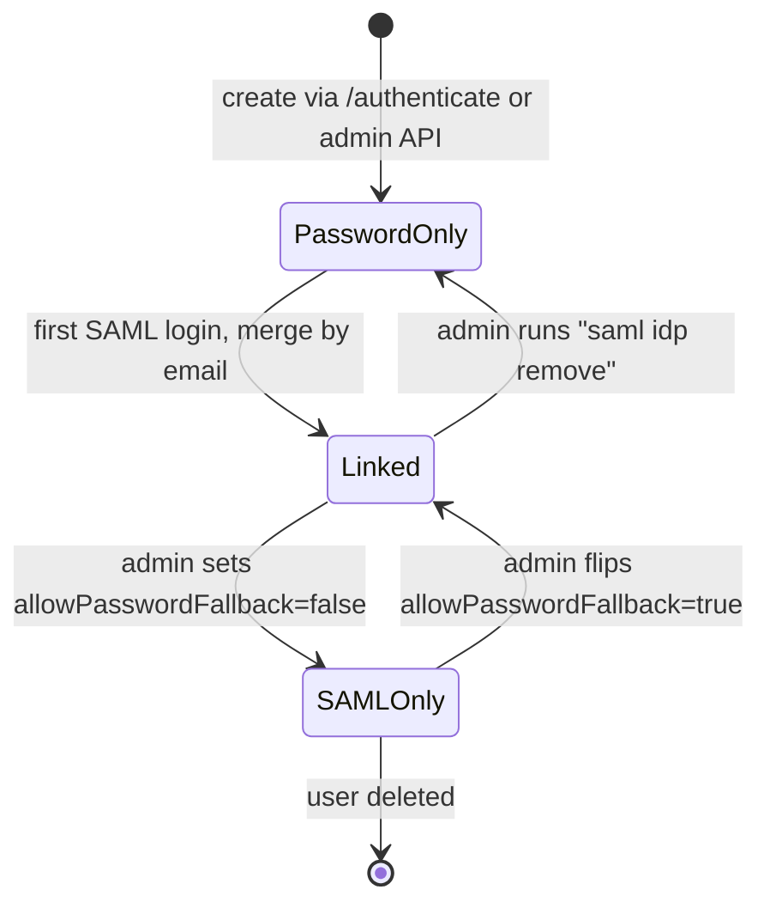

Fields governing state: `authSource ∈ {password, saml}`, `externalSubject` (empty for `PasswordOnly`), `tenant.allowPasswordFallback`.

## Appendix M. Backward Compatibility Matrix

|Concern|Before|After|Impact|
|---|---|---|---|
|`POST /authenticate`|HS256 idToken from password|Unchanged for `PasswordOnly` users; returns 409 for `SAMLOnly` with header `Location: /saml/login/{tid}`|Relying parties: 0 change|
|`POST /token` (exchange)|HS256 -> RS256|Unchanged|0 change|
|JWKS contract|RS256 pub key|Unchanged|0 change|
|idToken claim set|`sub, tid, iat, exp`|`+ amr` (RFC 8176)|Relying parties ignoring unknown claims: 0 change|
|User record shape|10 fields|`+ authSource, + externalSubject`|Migration tool runs once|
|Redis keyspace|`user:*, session:*`|`+ saml:*`|Keyspace notifications unaffected|
|Helm `values.yaml`|no `saml` key|`+ saml.*`|Default `enabled=false` preserves behavior|
|CLI `tikti`|no `saml` subcommand|`+ tikti saml …`|Prior commands unaffected|
|Prometheus registry|existing metrics|`+ tikti_saml_*`|Dashboards continue to render|

## Appendix N. Local Dev Stack

`hack/saml/docker-compose.yaml`:

```yaml
services:
  redis:
    image: redis:7-alpine
    ports: ["6379:6379"]
  idp:
    image: kristophjunge/test-saml-idp:1.15
    environment:
      SIMPLESAMLPHP_SP_ENTITY_ID: http://localhost:8080/saml
      SIMPLESAMLPHP_SP_ASSERTION_CONSUMER_SERVICE: http://localhost:8080/saml/acs
      SIMPLESAMLPHP_SP_SINGLE_LOGOUT_SERVICE: http://localhost:8080/saml/slo
    ports: ["8081:8080"]
  tikti:
    build: ../..
    environment:
      TIKTI_CONFIG: /etc/tikti/tikti.yaml
      SAML_SP_SIGNING_KEY_PATH: /etc/tikti/saml/sp.key
    volumes:
      - ./tikti.dev.yaml:/etc/tikti/tikti.yaml
      - ./sp.key:/etc/tikti/saml/sp.key
      - ./sp.crt:/etc/tikti/saml/sp.crt
    depends_on: [redis, idp]
    ports: ["8080:8080"]
```

`Makefile` additions:

```text
.PHONY: saml-dev saml-integration saml-keys

saml-keys:
	openssl req -x509 -newkey rsa:2048 -keyout hack/saml/sp.key -out hack/saml/sp.crt \
	  -nodes -days 365 -subj "/CN=tikti-sp"

saml-dev: saml-keys
	docker compose -f hack/saml/docker-compose.yaml up --build

saml-integration:
	go test -count=1 ./test/integration -run TestSAMLE2E
```

To bootstrap, run `make saml-dev`, then execute `curl -sS -c cookies -b cookies http://localhost:8080/saml/login/dev` and complete the login at the IdP's test page. The final redirect carries `Set-Cookie: tikti_idt=...`.

## Appendix O. SP Metadata XML Sample

```xml
<md:EntityDescriptor xmlns:md="urn:oasis:names:tc:SAML:2.0:metadata"
    entityID="https://auth.example.com/saml" validUntil="2027-04-24T00:00:00Z">
  <md:SPSSODescriptor AuthnRequestsSigned="true" WantAssertionsSigned="true"
      protocolSupportEnumeration="urn:oasis:names:tc:SAML:2.0:protocol">
    <md:KeyDescriptor use="signing">
      <ds:KeyInfo xmlns:ds="http://www.w3.org/2000/09/xmldsig#">
        <ds:X509Data><ds:X509Certificate>MIID...</ds:X509Certificate></ds:X509Data>
      </ds:KeyInfo>
    </md:KeyDescriptor>
    <md:KeyDescriptor use="encryption">
      <ds:KeyInfo xmlns:ds="http://www.w3.org/2000/09/xmldsig#">
        <ds:X509Data><ds:X509Certificate>MIID...</ds:X509Certificate></ds:X509Data>
      </ds:KeyInfo>
      <md:EncryptionMethod Algorithm="http://www.w3.org/2009/xmlenc11#aes256-gcm"/>
      <md:EncryptionMethod Algorithm="http://www.w3.org/2001/04/xmlenc#rsa-oaep-mgf1p"/>
    </md:KeyDescriptor>
    <md:SingleLogoutService
      Binding="urn:oasis:names:tc:SAML:2.0:bindings:HTTP-Redirect"
      Location="https://auth.example.com/saml/slo"/>
    <md:SingleLogoutService
      Binding="urn:oasis:names:tc:SAML:2.0:bindings:HTTP-POST"
      Location="https://auth.example.com/saml/slo"/>
    <md:NameIDFormat>urn:oasis:names:tc:SAML:1.1:nameid-format:emailAddress</md:NameIDFormat>
    <md:AssertionConsumerService index="0" isDefault="true"
      Binding="urn:oasis:names:tc:SAML:2.0:bindings:HTTP-POST"
      Location="https://auth.example.com/saml/acs"/>
  </md:SPSSODescriptor>
</md:EntityDescriptor>
```

## Appendix P. AuthnRequest and Response Samples

### P.1 AuthnRequest (decoded, pre-sign)

```xml
<samlp:AuthnRequest xmlns:samlp="urn:oasis:names:tc:SAML:2.0:protocol"
    xmlns:saml="urn:oasis:names:tc:SAML:2.0:assertion"
    ID="_a1b2c3d4e5f6a1b2c3d4e5f6a1b2c3d4e5f6a1b2"
    Version="2.0"
    IssueInstant="2026-04-24T17:32:01Z"
    Destination="https://idp.example.com/sso"
    ProtocolBinding="urn:oasis:names:tc:SAML:2.0:bindings:HTTP-POST"
    AssertionConsumerServiceURL="https://auth.example.com/saml/acs">
  <saml:Issuer>https://auth.example.com/saml</saml:Issuer>
  <samlp:NameIDPolicy
     Format="urn:oasis:names:tc:SAML:1.1:nameid-format:emailAddress"
     AllowCreate="true"/>
</samlp:AuthnRequest>
```

HTTP-Redirect emission: `SAMLRequest=deflate(base64(xml))`, `SigAlg=http://www.w3.org/2001/04/xmldsig-more#rsa-sha256`, `Signature=base64(RSA-SHA256(SAMLRequest=...&SigAlg=...))`.

### P.2 Response (IdP -> SP, excerpt)

```xml
<samlp:Response xmlns:samlp="urn:oasis:names:tc:SAML:2.0:protocol"
    ID="_resp_9f8e..." InResponseTo="_a1b2c3d4e5f6a1b2c3d4e5f6a1b2c3d4e5f6a1b2"
    Version="2.0" IssueInstant="2026-04-24T17:32:09Z"
    Destination="https://auth.example.com/saml/acs">
  <saml:Issuer xmlns:saml="urn:oasis:names:tc:SAML:2.0:assertion">https://idp.example.com/saml</saml:Issuer>
  <samlp:Status><samlp:StatusCode Value="urn:oasis:names:tc:SAML:2.0:status:Success"/></samlp:Status>
  <saml:Assertion xmlns:saml="urn:oasis:names:tc:SAML:2.0:assertion"
      ID="_assert_7c6b..." Version="2.0" IssueInstant="2026-04-24T17:32:09Z">
    <saml:Issuer>https://idp.example.com/saml</saml:Issuer>
    <ds:Signature xmlns:ds="http://www.w3.org/2000/09/xmldsig#">...</ds:Signature>
    <saml:Subject>
      <saml:NameID Format="urn:oasis:names:tc:SAML:1.1:nameid-format:emailAddress">ova@example.com</saml:NameID>
      <saml:SubjectConfirmation Method="urn:oasis:names:tc:SAML:2.0:cm:bearer">
        <saml:SubjectConfirmationData
           NotOnOrAfter="2026-04-24T17:37:09Z"
           Recipient="https://auth.example.com/saml/acs"
           InResponseTo="_a1b2c3d4e5f6a1b2c3d4e5f6a1b2c3d4e5f6a1b2"/>
      </saml:SubjectConfirmation>
    </saml:Subject>
    <saml:Conditions NotBefore="2026-04-24T17:31:59Z" NotOnOrAfter="2026-04-24T17:37:09Z">
      <saml:AudienceRestriction><saml:Audience>https://auth.example.com/saml</saml:Audience></saml:AudienceRestriction>
    </saml:Conditions>
    <saml:AuthnStatement AuthnInstant="2026-04-24T17:32:05Z" SessionIndex="_sess_42...">
      <saml:AuthnContext><saml:AuthnContextClassRef>urn:oasis:names:tc:SAML:2.0:ac:classes:PasswordProtectedTransport</saml:AuthnContextClassRef></saml:AuthnContext>
    </saml:AuthnStatement>
    <saml:AttributeStatement>
      <saml:Attribute Name="mail"><saml:AttributeValue>ova@example.com</saml:AttributeValue></saml:Attribute>
      <saml:Attribute Name="displayName"><saml:AttributeValue>Osvaldo Andrade</saml:AttributeValue></saml:Attribute>
      <saml:Attribute Name="groups">
        <saml:AttributeValue>tikti-admin</saml:AttributeValue>
        <saml:AttributeValue>ops</saml:AttributeValue>
      </saml:Attribute>
    </saml:AttributeStatement>
  </saml:Assertion>
</samlp:Response>
```

## Appendix Q. Error Page Contract

The error handler renders four neutral pages via `internal/saml/http.go:renderError`. HTTP status codes map to reason buckets as follows:

|Bucket|HTTP status|Message shown to user|Maps from reasons|
|---|--:|---|---|
|`bad_request`|400|"Login link is not valid. Start again from the beginning."|`destination_mismatch, request_not_found, missing_attribute`|
|`forbidden`|403|"Login could not be verified. Contact your administrator."|`signature_invalid, assertion_signature_invalid, signature_wrapping, algorithm_disallowed, decrypt_failed, xxe_detected, audience_mismatch, issuer_mismatch, subject_confirmation_mismatch, request_replay, clock_skew, status_not_success`|
|`not_configured`|404|"Single sign-on is not configured for this workspace."|`tid_unknown`|
|`internal`|500|"We could not complete your login. Try again in a few seconds."|`idp_metadata_stale, internal_error`|

Each page includes a 12-character server-side error ID (sent via the `X-Tikti-Error-ID` header, UUIDv7 truncated) that support staff can grep in logs. No reason text appears on the page.

## Appendix R. Concurrency Model and Graceful Shutdown

Each HTTP request runs in one goroutine following the standard `net/http` model. Context cancellation propagates to Redis calls because `redis.Client` respects `ctx`.

Two background workers run alongside request handling. The IdP metadata refresher uses one goroutine with a ticker firing every `refreshIntervalHours` plus a 5-minute jitter; it reads every `saml:idp:*` key, re-fetches the source URL, validates the document, and overwrites the record. The key holder watcher uses one goroutine for SIGHUP handling and one optional goroutine for fsnotify.

Shutdown sequence on SIGTERM:

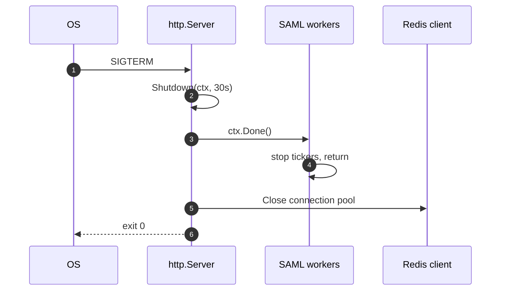

No request is interrupted if it completes within 30 s. After 30 s the process exits and Kubernetes replaces it. All Redis state is durable (AOF or RDB depending on the deployment); no in-memory mutation is lost.

---

**End of document.**
