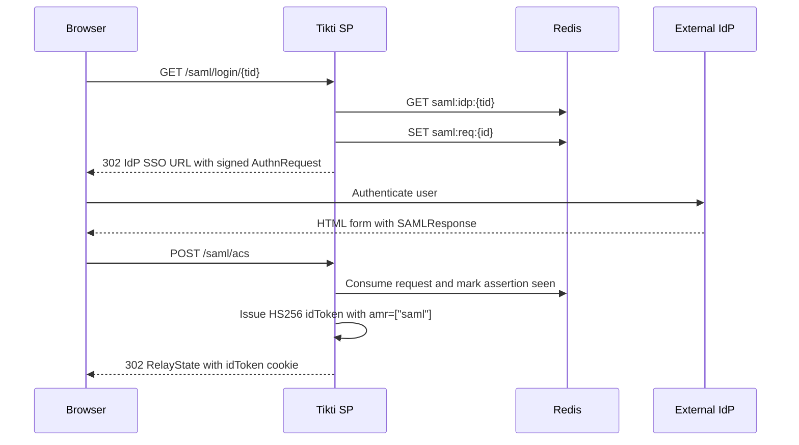

# SAML Federation

Tikti supports SAML 2.0 federation with Tikti acting as the Service Provider (SP). The feature lets a tenant delegate browser authentication to an external Identity Provider (IdP) such as Azure AD / Entra ID, Okta, Ping Identity, Google Workspace, AD FS, OneLogin, JumpCloud, Keycloak, or any compatible SAML 2.0 IdP.

SAML is additive to the existing password and OOB sign-in paths. A successful SAML login issues the same HS256 idToken contract used by the rest of Tikti, with `amr: ["saml"]` added to identify the authentication method. Downstream token exchange, tenant authorization, and JWKS validation continue to work through the same APIs.

## What the feature includes

- SP-initiated SSO through `GET /saml/login/{tid}` and `POST /saml/acs`.
- SP-initiated and IdP-initiated Single Logout through `/saml/logout/{tid}` and `/saml/slo`.
- SP metadata generation for IdP onboarding through `/saml/metadata` and `tikti-cli saml sp metadata`.
- Per-tenant IdP trust records stored in Redis under `saml:idp:{tid}`.
- Email-domain discovery mappings through `/saml/discover` and `tikti-cli saml domain`.
- IdP metadata registration, refresh, list, show, and removal commands.
- SP signing key rotation with a two-step `--prepare` then `--commit` workflow.
- Replay protection, request correlation, audit events, and Prometheus metrics for SAML operations.

## Configuration

SAML routes are mounted only when `saml.enabled` is true. The server validates the SP signing key path, signing certificate path, entity ID, and ACS URL at startup.

```yaml
saml:
  enabled: true
  sp:
    entityID: "https://auth.example.com/saml"
    acsURL: "https://auth.example.com/saml/acs"
    sloURL: "https://auth.example.com/saml/slo"
    signingKeyPath: "/etc/tikti/saml/sp.key"
    signingCertPath: "/etc/tikti/saml/sp.crt"
    encryptionKeyPath: ""
    encryptionCertPath: ""
    keyBits: 2048
    clockSkewSeconds: 120
    requestTTLSeconds: 300
    allowedSigAlgs: ["rsa-sha256"]
    allowedDigestAlgs: ["sha256"]
    canonicalization: "xml-exc-c14n"
    requireAssertionSigned: true
    requireEncryptedAssertion: false
  acs:
    postLoginURL: "/dashboard"
    deliveryMode: "cookie"
    cookieName: "tikti_idt"
    cookieSameSite: "Lax"
    cookieSecure: true
    cookieHTTPOnly: true
    sessionTTL: 3600
  idp:
    refreshIntervalHours: 24
  discover:
    enabled: false
  metrics:
    enabled: true
    namespace: "tikti"
```

Per-tenant IdP records are not stored in the static YAML file. They are registered at runtime through the CLI and stored in Redis so operators can onboard or rotate IdP metadata without redeploying the service.

## Endpoints

| Endpoint | Method | Purpose |
|---|---|---|
| `/saml/metadata` | GET | Emits SP metadata XML to import into an IdP. |
| `/saml/login/{tid}` | GET | Starts SP-initiated SSO for a tenant. |
| `/saml/acs` | POST | Receives the IdP SAML Response and issues the local idToken. |
| `/saml/logout/{tid}` | GET | Starts SP-initiated Single Logout. |
| `/saml/slo` | GET, POST | Receives SLO messages from the IdP. |
| `/saml/discover` | GET | Resolves an email domain to a tenant for IdP routing. |

The SAML endpoints live outside the `/v1/` JSON API prefix because they follow browser redirect and form-post binding rules from the SAML specifications.

## Onboarding a Tenant IdP

Build or install the CLI first:

```bash
go build -o tikti-cli ./cmd/tikti-cli
```

Generate the SP metadata XML and give it to the tenant's IdP administrator:

```bash
./tikti-cli saml sp metadata \
  --entity-id https://auth.example.com/saml \
  --acs-url https://auth.example.com/saml/acs \
  --slo-url https://auth.example.com/saml/slo \
  --signing-cert /etc/tikti/saml/sp.crt \
  --out sp-metadata.xml
```

Register the IdP after the administrator gives you an IdP metadata URL or XML file:

```bash
./tikti-cli saml idp register \
  --tid tenant-1 \
  --metadata-url https://idp.example.com/metadata \
  --attr-map attr-map.json
```

Use `--metadata-file /path/to/idp-metadata.xml` instead of `--metadata-url` when the IdP provides a local XML file. The optional `--attr-map` file maps IdP assertion attributes into Tikti fields. Tikti uses the `email`, `name`, and `roles` keys when issuing the local idToken and provisioning the user.

Map an email domain to the tenant when you want users to start from the discovery endpoint instead of a tenant-specific login URL:

```bash
./tikti-cli saml domain add --tid tenant-1 --domain example.com
```

Verify the stored trust relationship:

```bash
./tikti-cli saml idp show --tid tenant-1 --output json
./tikti-cli saml idp list
```

Generate a manual test AuthnRequest URL when validating an IdP setup:

```bash
./tikti-cli saml test \
  --tid tenant-1 \
  --email user@example.com \
  --entity-id https://auth.example.com/saml \
  --acs-url https://auth.example.com/saml/acs \
  --signing-key /etc/tikti/saml/sp.key \
  --signing-cert /etc/tikti/saml/sp.crt
```

## Login Flow

1. The browser requests `/saml/login/{tid}` with an optional `RelayState`.
2. Tikti loads the tenant IdP record from Redis, creates a signed AuthnRequest, stores request correlation state with the configured request TTL, sets the SAML state cookie, and redirects the browser to the IdP.
3. The IdP authenticates the user and posts a SAML Response to `/saml/acs`.
4. Tikti validates the response, enforces replay protection, issues an HS256 idToken with `amr: ["saml"]`, stores SLO session index state, sets the idToken cookie, and redirects to a safe relative `RelayState` or `saml.acs.postLoginURL`.
5. The application can exchange the idToken through `POST /v1/accounts/token/exchange` exactly as it does for password and OOB sign-in.



## Validation and Security Controls

Tikti rejects unsigned or weakly signed responses before normal assertion processing. The default signature allowlist accepts RSA-SHA256 and blocks SHA-1, MD5, legacy canonicalization, DES, and TripleDES algorithms.

The ACS path validates request correlation, destination, response status, signatures, issuer, audience, clock bounds, subject confirmation, and replay state. Assertion IDs are recorded with a replay TTL so a consumed assertion cannot be submitted twice.

The tenant identifier is taken from the `/saml/login/{tid}` URL and request correlation state, not from SAML assertion attributes. Assertion attributes named `tid`, `tenant_id`, or `tenantId` are treated as untrusted tenant overrides and ignored.

## Single Logout

For SP-initiated logout, the browser calls `/saml/logout/{tid}`. Tikti builds a signed LogoutRequest with the user's NameID and SessionIndex, redirects to the IdP SLO endpoint, receives the IdP response at `/saml/slo`, and clears local SAML session state.

For IdP-initiated logout, the IdP sends a LogoutRequest to `/saml/slo`. Tikti validates the message, clears the matching session index, and returns a LogoutResponse to the IdP.

## Key and Certificate Rotation

SP key rotation uses the `saml sp rotate` command group:

```bash
./tikti-cli saml sp rotate --prepare \
  --entity-id https://auth.example.com/saml \
  --acs-url https://auth.example.com/saml/acs \
  --slo-url https://auth.example.com/saml/slo \
  --signing-key /etc/tikti/saml/sp.key \
  --signing-cert /etc/tikti/saml/sp.crt \
  --redis-addr localhost:6379 \
  --out sp-metadata.xml

./tikti-cli saml sp rotate --commit \
  --entity-id https://auth.example.com/saml \
  --acs-url https://auth.example.com/saml/acs \
  --slo-url https://auth.example.com/saml/slo \
  --signing-key /etc/tikti/saml/sp.key \
  --signing-cert /etc/tikti/saml/sp.crt \
  --redis-addr localhost:6379 \
  --out sp-metadata.xml
```

The prepare step publishes metadata with both the old and new signing certificates and stores rotation state at `saml:sp:rotation`. After IdPs refresh their cached metadata, the commit step publishes metadata with only the new certificate and removes the rotation state.

IdP signing certificate rotation is handled by updating or re-registering the IdP metadata:

```bash
./tikti-cli saml idp update --tid tenant-1 --metadata-url https://idp.example.com/metadata
```

## Operations

SAML metrics are registered with the `tikti_saml_*` prefix, including AuthnRequest counts, response accept/reject counts, validation failures by reason, replay blocks, JIT provisions, metadata refresh results, IdP round-trip latency, and SP/IdP certificate expiry gauges.

Audit records are emitted for assertion decisions and include tenant ID, request ID, issuer, assertion ID, decision, reason, and duration. SAML assertion XML, tokens, private keys, and raw secrets must never be logged.

## Related Pages

- [Get Started](Get-Started)
- [API Specification](API-Specification)
- [CLI Reference](CLI-Reference)
- [Tokens and Keys](Tokens-and-Keys)
- [Operations and SLO](Operations-and-SLO)
- [Troubleshooting](Troubleshooting)
- [SAML SSO use case](Use-Cases-SAML-SSO)
