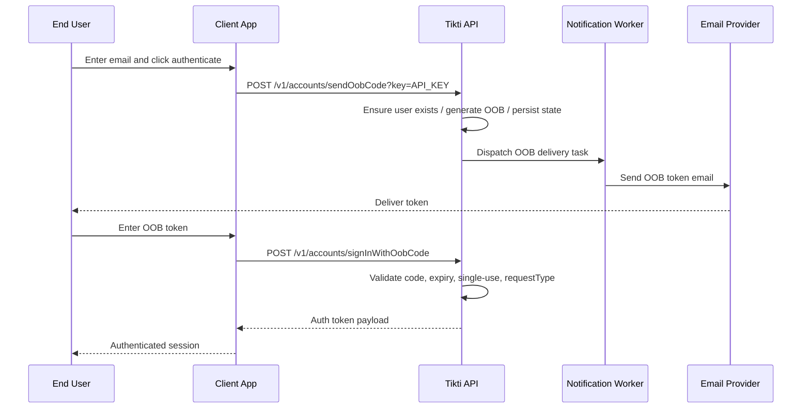

# OOB Email Sign-In

Authenticate a user via a one-time code sent to email. The user never sets a password; authentication relies on control of the email inbox.

## Actors

- End user
- Client application (frontend)
- Tikti API
- Notification worker (downstream)

## Preconditions

An API key is configured for protected endpoints. The OOB request type is supported by Tikti. An email delivery path is available downstream.

## Main flow

1. User enters an email address and triggers sign-in in the client application.
2. Client calls `POST /v1/accounts/sendOobCode?key=API_KEY` with the email and request type.
3. Tikti ensures the user identity exists (creates one if missing), generates an OOB code, and stores OOB state.
4. Tikti dispatches OOB delivery through the asynchronous integration path to the notification worker.
5. User receives the code by email.
6. Client sends `POST /v1/accounts/signInWithOobCode` with email, OOB code, and request type.
7. Tikti validates the code, expiry, single-use constraint, and request type match.
8. Tikti returns the authentication token payload.

### Sequence diagram

## Expected outcomes

A user without a password can authenticate by proving control of the email address. The OOB code is single-use and expires at a fixed time. A request type mismatch causes rejection.

## Failure scenarios

Expired code: authentication denied; the user must request a new OOB code.

Consumed code reuse: authentication denied.

Invalid code or mismatched request type: authentication denied.

## Related specs

- [API Specification](API-Specification)
- [Tokens and Keys](Tokens-and-Keys)
