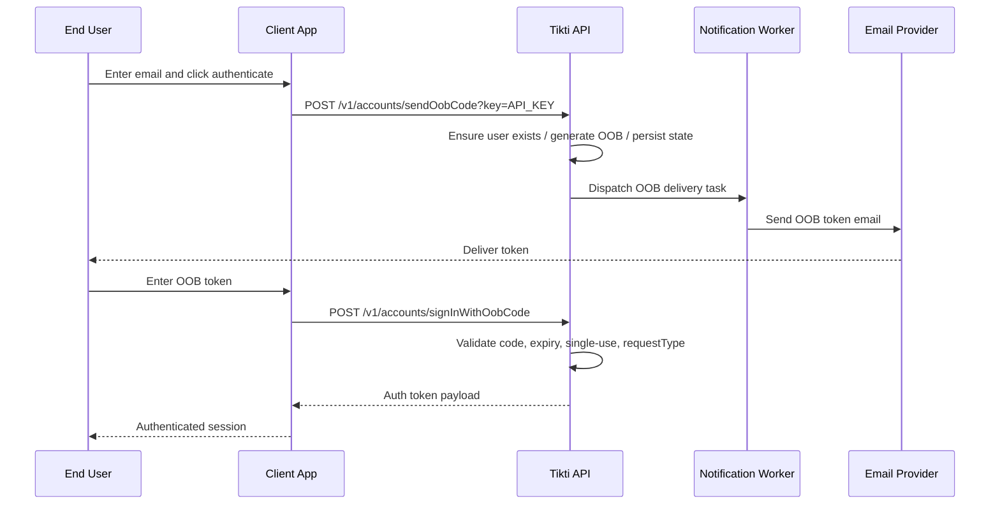

# OOB Email Sign-In

Authenticate a user via a one-time code sent to email.

## Actors

- End user
- Client application (frontend)
- Tikti API
- Notification worker (downstream)

## Preconditions

- API key is configured for protected endpoints.
- OOB request type is supported by Tikti.
- Email delivery path is available downstream.

## Main flow

1. User enters email and triggers sign-in in the client app.
2. Client calls `POST /v1/accounts/sendOobCode?key=API_KEY` with email and request type.
3. Tikti ensures user identity exists (create if missing), generates OOB code, and stores OOB state.
4. Tikti dispatches OOB delivery through the asynchronous integration path.
5. User receives the code by email.
6. Client sends `POST /v1/accounts/signInWithOobCode` with email, OOB code, and request type.
7. Tikti validates code, expiry, single-use, and request type match.
8. Tikti returns authentication token payload.

### Sequence diagram

## Expected outcomes

- New user can authenticate without password bootstrap.
- OOB code is single-use and expires deterministically.
- Request type mismatch is rejected.

## Failure scenarios

- Expired code -> authentication denied, requires new OOB request.
- Consumed code reuse -> authentication denied.
- Invalid code or mismatched request type -> authentication denied.

## Related specs

- [API Specification](API-Specification)
- [Tokens and Keys](Tokens-and-Keys)
