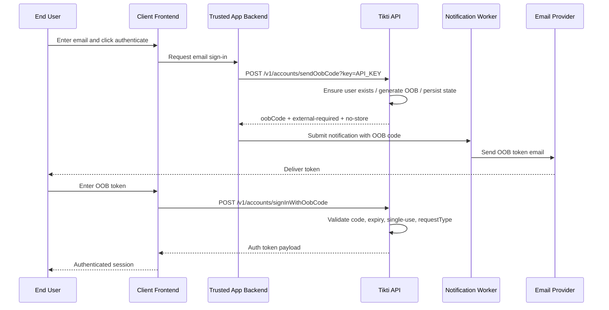

# OOB Email Sign-In

Authenticate a user via a one-time code sent to email. The user never sets a password; authentication relies on control of the email inbox.

## Actors

- End user
- Client application (frontend and trusted backend)
- Tikti API
- Notification worker (downstream)

## Preconditions

An API key is configured only in the trusted backend. The OOB request type is
supported by Tikti. A real email delivery path is available downstream; Tikti
itself does not dispatch email or enqueue a notification job.

## Main flow

1. User enters an email address and triggers sign-in in the client application.
2. The frontend submits the request to its trusted application backend.
3. The backend calls `POST /v1/accounts/sendOobCode?key=API_KEY` with the email and request type.
4. Tikti ensures the user identity exists (creates one if missing), generates an OOB code, stores OOB state, and returns the compatibility response with `X-Tikti-OOB-Delivery: external-required` and `Cache-Control: no-store`.
5. The backend passes the code directly to its notification worker, which sends the email through the configured provider.
6. User receives the code by email.
7. Client sends `POST /v1/accounts/signInWithOobCode` with email and OOB code.
8. Tikti validates the code, expiry, single-use constraint, and request type match.
9. Tikti returns the authentication token payload.

### Sequence diagram

## Expected outcomes

A user without a password can authenticate by proving control of the email
address. The OOB code is single-use and expires at a fixed time. A request type
mismatch causes rejection. Until a real dispatcher is integrated into Tikti,
the trusted backend is responsible for delivery and for keeping the returned
code out of browser responses, URLs, logs, traces, metrics, and audit records.

## Failure scenarios

Expired code: authentication denied; the user must request a new OOB code.

Consumed code reuse: authentication denied.

Invalid code or mismatched request type: authentication denied.

## Related specs

- [API Specification](API-Specification)
- [Tokens and Keys](Tokens-and-Keys)
