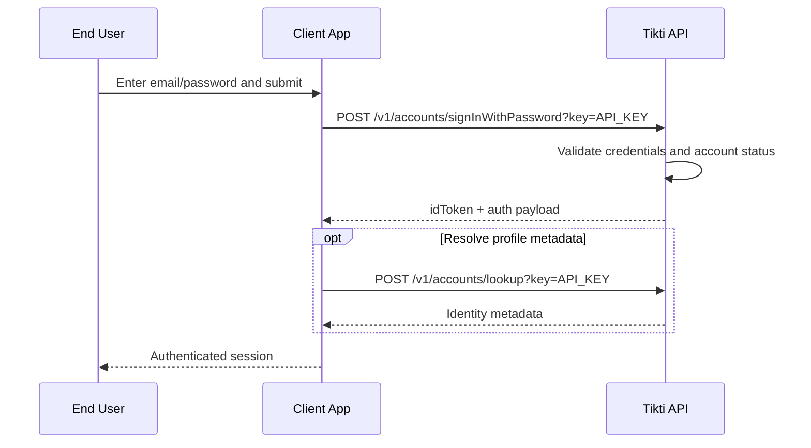

# Password Sign-In

Authenticate an existing user with email and password.

## Actors

- End user
- Client application
- Tikti API

## Preconditions

- User exists with active status.
- Password hash is present for the identity.

## Main flow

1. User submits email and password in the client app.
2. Client calls `POST /v1/accounts/signInWithPassword?key=API_KEY`.
3. Tikti validates credentials and account status.
4. Tikti returns idToken and standard auth payload.
5. Client may call `POST /v1/accounts/lookup?key=API_KEY` to resolve identity metadata.

### Sequence diagram

## Expected outcomes

- Correct credentials produce a valid auth payload.
- Invalid credentials are rejected with stable error semantics.
- Suspended or inactive users cannot authenticate.

## Failure scenarios

- Wrong password -> authentication denied.
- Unknown email -> authentication denied.
- Suspended user -> authentication denied even with correct password.

## Related specs

- [API Specification](API-Specification)
- [Operations and SLO](Operations-and-SLO)
