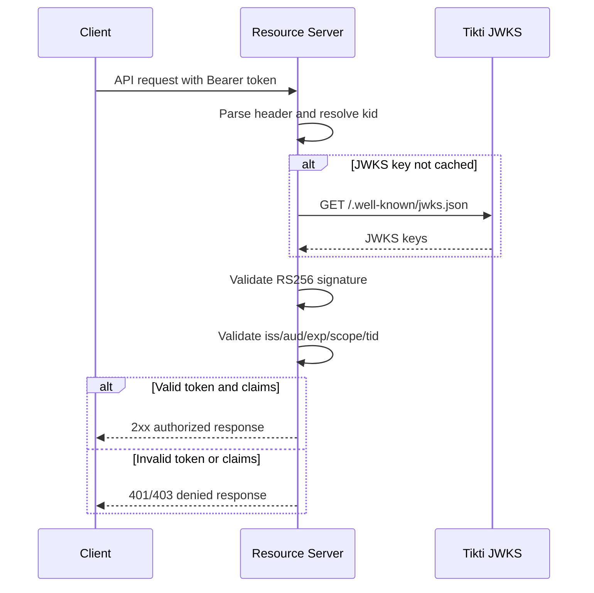

# Resource Server Token Validation

Validate Tikti-issued access tokens in downstream APIs.

## Actors

- Resource server (for example, codeQ API)
- Tikti JWKS endpoint

## Preconditions

- Resource server knows expected issuer and allowed audiences.
- Resource server can fetch and cache Tikti JWKS.

## Main flow

1. Client sends bearer token to resource server.
2. Resource server parses token header and resolves `kid`.
3. Resource server fetches or reuses cached key material from `/.well-known/jwks.json`.
4. Signature is validated with RS256 public key.
5. Claims are validated: `iss`, `aud`, `exp`, and required scopes.
6. Tenant claim (`tid`) is used to enforce tenant isolation.
7. Request is accepted only if all checks pass.

### Sequence diagram

## Expected outcomes

- Invalid or forged tokens are rejected deterministically.
- Tokens with wrong `aud` or `iss` are rejected.
- Expired tokens are rejected without ambiguity.

## Failure scenarios

- Unknown `kid` with stale cache -> JWKS refresh required, then reject if unresolved.
- Missing required scope -> forbidden.
- Missing or invalid tenant context -> forbidden for tenant-scoped operations.

## Related specs

- [Tokens and Keys](Tokens-and-Keys)
- [codeQ Integration](codeQ-Integration)
- [Security Model](Security-Model)
