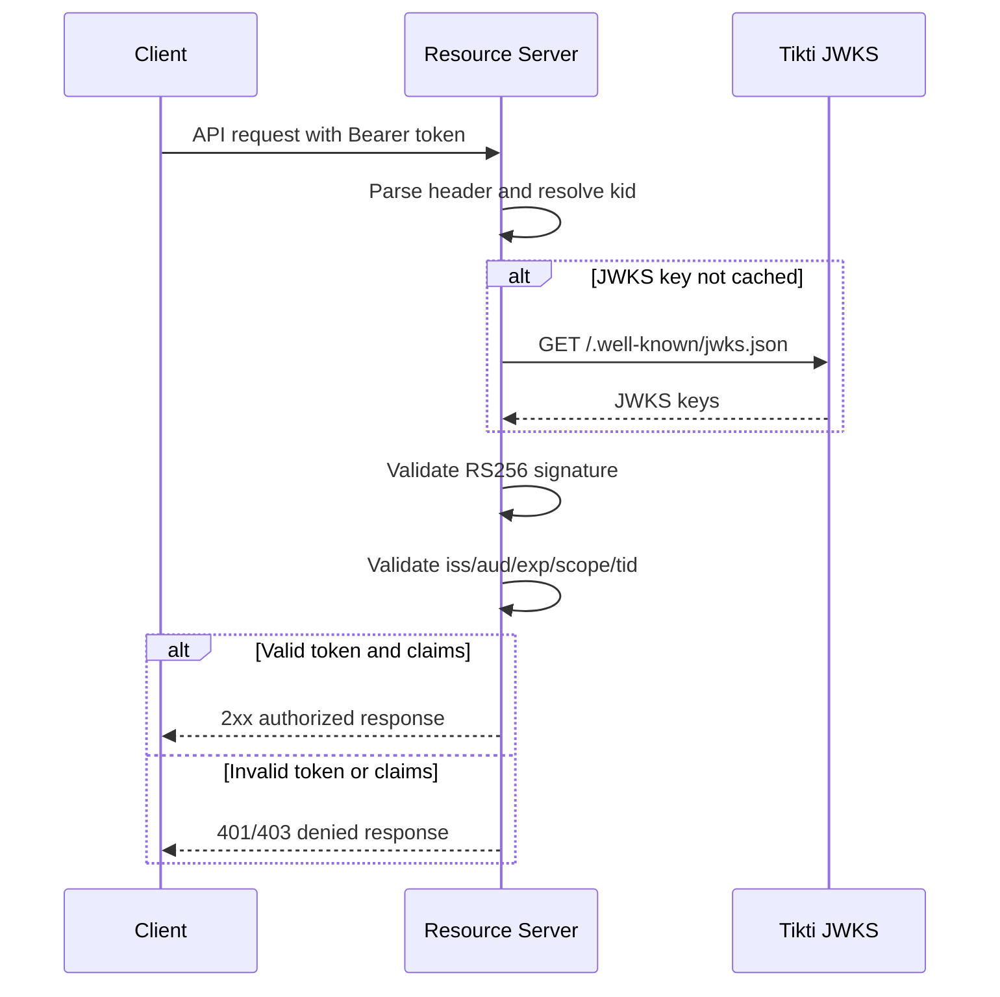

# Resource Server Token Validation

Validate Tikti-issued RS256 access tokens in downstream APIs. This flow applies to any resource server (for example, codeQ) that accepts tokens issued through password sign-in, OOB sign-in, or SAML SSO followed by token exchange.

## Actors

- Resource server (for example, codeQ API)
- Tikti JWKS endpoint

## Preconditions

The resource server knows the expected issuer and allowed audiences. The resource server can fetch and cache the Tikti JWKS.

## Main flow

1. Client sends a bearer token to the resource server.
2. Resource server parses the token header and resolves the `kid`.
3. Resource server fetches or reuses cached key material from `/.well-known/jwks.json`.
4. Signature is validated with the RS256 public key.
5. Claims are validated: `iss`, `aud`, `exp`, and required scopes.
6. The `tid` claim is used to enforce tenant isolation.
7. The request is accepted only if all checks pass.

### Sequence diagram

## Expected outcomes

Invalid or forged tokens are rejected. Tokens with a wrong `aud` or `iss` are rejected. Expired tokens are rejected. The `amr` claim (for example, `saml` or `password`) does not affect validation; the resource server treats all authentication methods identically once the RS256 access token is issued.

## Failure scenarios

Unknown `kid` with a stale cache: the resource server refreshes the JWKS and rejects the token if the `kid` remains unresolved.

Missing required scope: the resource server returns 403.

Missing or invalid `tid`: the resource server returns 403 for tenant-scoped operations.

## Related specs

- [Tokens and Keys](Tokens-and-Keys)
- [codeQ Integration](codeQ-Integration)
- [Security Model](Security-Model)
