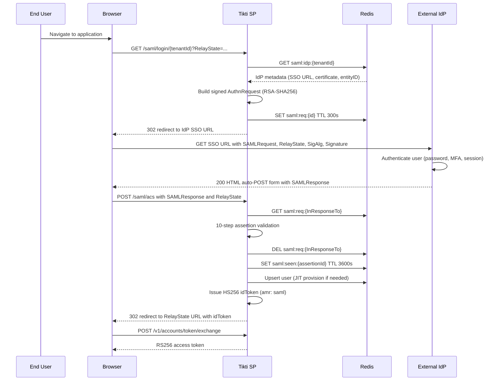

# SAML SSO

Authenticate a user through an external SAML 2.0 Identity Provider via SP-initiated SSO. Tikti acts as the Service Provider, delegating authentication to the tenant's configured IdP while issuing the same HS256 idToken that the password and OOB flows produce. Downstream token exchange and JWKS validation remain unchanged.

## Actors

- End user
- Browser
- Tikti SP
- External IdP (Azure AD / Okta / Ping / Google Workspace)

## Preconditions

The tenant has a registered IdP configuration stored at `saml:idp:{tenantId}` in Redis. The tenant admin has imported Tikti SP metadata into the IdP admin console. The IdP signing certificate is pinned in Tikti at registration time via `tikti-cli saml idp register --tid {tenantId}`.

## Main flow

1. User navigates to `/saml/login/{tenantId}`, or the application triggers this redirect.
2. Tikti loads the tenant IdP metadata from `saml:idp:{tenantId}`, builds a signed `AuthnRequest` (RSA-SHA256, HTTP-Redirect binding), stores the request ID at `saml:req:{id}` with a 300-second TTL, and redirects the browser to the IdP SSO URL with `SAMLRequest`, `RelayState`, `SigAlg`, and `Signature` query parameters.
3. The IdP authenticates the user through its own mechanisms (password, MFA, or existing session).
4. The IdP posts a signed SAML Response to `/saml/acs` via HTTP-POST binding. The browser submits the `SAMLResponse` and `RelayState` form fields.
5. Tikti validates the assertion in 10 sequential steps: (1) `InResponseTo` exists in `saml:req:*`, (2) `Destination` equals the ACS URL, (3) top-level `Status` is `Success`, (4) Response signature verifies against the pinned IdP certificate, (5) decrypt `EncryptedAssertion` with the SP key if present, (6) Assertion signature verifies, (7) `Issuer` equals the configured IdP `entityID`, (8) `Audience` contains the Tikti `entityID`, (9) `NotBefore` and `NotOnOrAfter` fall within a 120-second skew window, (10) `SubjectConfirmationData` `Recipient` and `NotOnOrAfter` are valid. On success, Tikti deletes the request record, stores the assertion ID at `saml:seen:{assertionId}` with a 3600-second TTL to prevent replay, JIT-provisions the user if no account exists for the tenant, and issues an HS256 idToken with the `amr: saml` claim. Tikti redirects the browser to the `RelayState` URL.
6. The application exchanges the idToken for an RS256 access token via `POST /v1/accounts/token/exchange`.

### Sequence diagram

## Expected outcomes

The user is authenticated with a tenant-scoped idToken. JIT-provisioned users receive a membership record in the authenticating tenant. The idToken is indistinguishable from a password-issued token except for the `amr: saml` claim. Downstream relying parties validate the RS256 access token through the same JWKS endpoint and claim structure used by all other authentication flows.

## Failure scenarios

IdP unreachable: the browser receives an HTTP error or timeout at the IdP SSO URL. Tikti does not intervene; the request record expires after 300 seconds.

Assertion signature invalid: validation fails at step 4 or step 6. Tikti returns a 403 to the browser and logs the rejection reason.

Clock skew beyond 120 seconds: validation fails at step 9. The `NotBefore` or `NotOnOrAfter` condition is outside the permitted window.

Assertion replayed: a previously consumed assertion ID exists at `saml:seen:{assertionId}`. Tikti rejects the request.

`InResponseTo` mismatch: the request ID referenced in the SAML Response does not exist in `saml:req:*`, either because it expired after 300 seconds or was never issued. Tikti rejects the request.

## Related specs

- [API Specification](API-Specification)
- [Tokens and Keys](Tokens-and-Keys)
- [SAML Federation](SAML-Federation)
- [SAML Federation HLD](../docs/12_saml_federation_hld.md)
