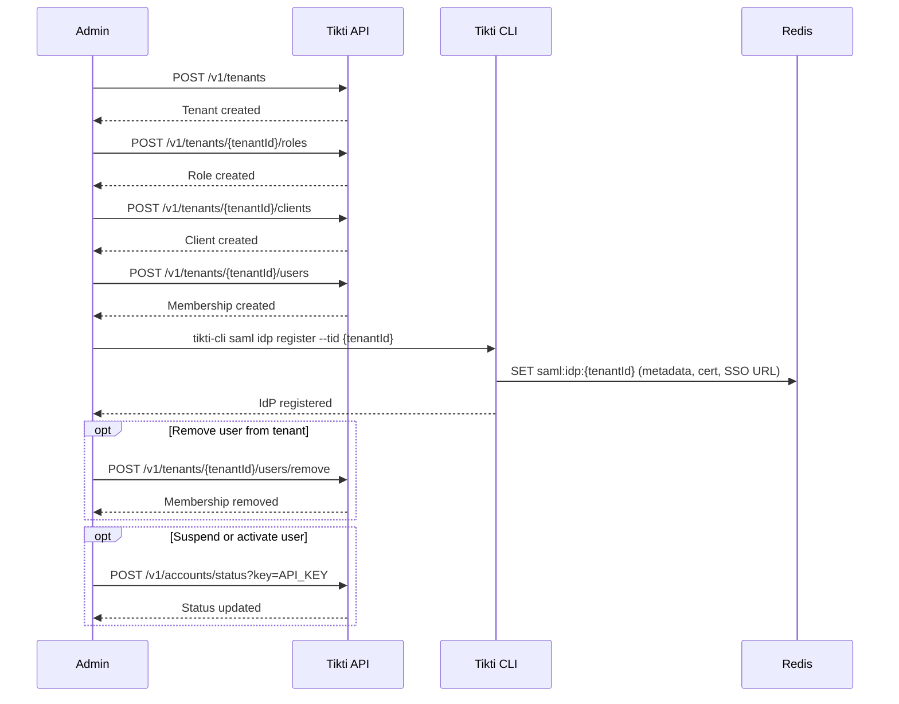

# Tenant Admin Lifecycle

Manage tenant resources, memberships, and identity federation through admin operations. This flow covers tenant creation through to IdP registration for SAML SSO.

## Actors

- Global admin or tenant admin
- Tikti API
- Tikti CLI

## Preconditions

The caller is authenticated and authorized for admin scopes. The target tenant exists for tenant-scoped operations (steps 2 onward).

## Main flow

1. Admin creates a tenant via `POST /v1/tenants`.
2. Admin creates tenant roles via `POST /v1/tenants/{tenantId}/roles`.
3. Admin creates tenant clients via `POST /v1/tenants/{tenantId}/clients`.
4. Admin adds users to the tenant via `POST /v1/tenants/{tenantId}/users`.
5. Admin registers a SAML IdP for the tenant via `tikti-cli saml idp register --tid {tenantId}`. This stores the IdP metadata, SSO URL, and pinned signing certificates at `saml:idp:{tenantId}` in Redis.
6. Admin removes users from the tenant via `POST /v1/tenants/{tenantId}/users/remove` when needed.
7. Admin suspends or reactivates users via account status operations when needed.

### Sequence diagram

## Expected outcomes

Tenant boundaries are enforced in every mutation. Role and client registries are deterministic and auditable. Membership changes are reflected in subsequent authorization decisions. After IdP registration, tenant users can authenticate via SAML SSO at `/saml/login/{tenantId}`.

## Failure scenarios

Non-admin caller: operation denied.

Invalid tenant identifier: operation denied with a contract error.

Invalid role or scope payload: validation error.

IdP registration with an invalid or expired signing certificate: registration rejected by the CLI.

## Related specs

- [API Specification](API-Specification)
- [Multi-Tenant Authorization](Multi-Tenant-Authorization)
- [SAML Federation](SAML-Federation)
