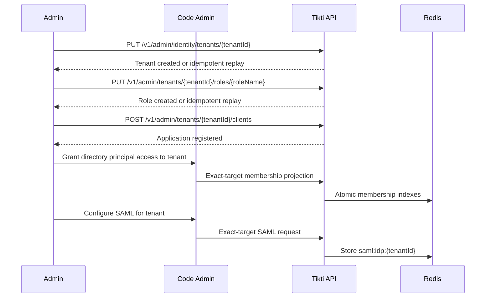

# Tenant Admin Lifecycle

Manage tenant metadata, roles, applications, and identity federation through
explicit-target administration. Global users, groups, and tenant access are
managed by Code Admin Identity V2.

## Actors

- Platform admin or exact-target tenant admin
- Code Admin API
- Tikti API
- Tikti CLI

## Preconditions

The caller presents the service API key in `X-API-Key` and a scoped RS256
access token. Cross-tenant administration additionally requires the persisted
`ADMIN` role and `tikti_platform_privilege=platform-admin` issuance claim.

## Main flow

1. A platform admin creates a tenant with `PUT /v1/admin/identity/tenants/{tenantId}`.
2. An authorized admin creates roles with `PUT /v1/admin/tenants/{tenantId}/roles/{roleName}`.
3. An authorized admin registers applications with `POST /v1/admin/tenants/{tenantId}/clients`.
4. Code Admin grants user or group access to that explicit tenant through Identity V2.
5. Code Admin configures SAML for that explicit tenant; Tikti persists the tenant-local IdP trust.

### Sequence diagram

## Expected outcomes

Tenant boundaries are enforced on every operation. No mutation derives its
target from a selector or active-tenant header. Role, application, membership,
and SAML records remain deterministic and tenant-scoped.

## Failure scenarios

- Missing or insufficient authority: request denied before storage access.
- Path/header/body tenant divergence: request rejected.
- Invalid tenant, role, or client payload: contract error.
- Conflicting idempotent create: `409 Conflict` without overwrite.
- Invalid or expired SAML signing material: configuration rejected.

## Cutover

The former `/v1/tenants...` admin aliases and Tikti membership CLI commands are
not retained. The HTTP cutover does not delete stored identities or access data.

## Related specs

- [API Specification](API-Specification)
- [Multi-Tenant Authorization](Multi-Tenant-Authorization)
- [SAML Federation](SAML-Federation)
