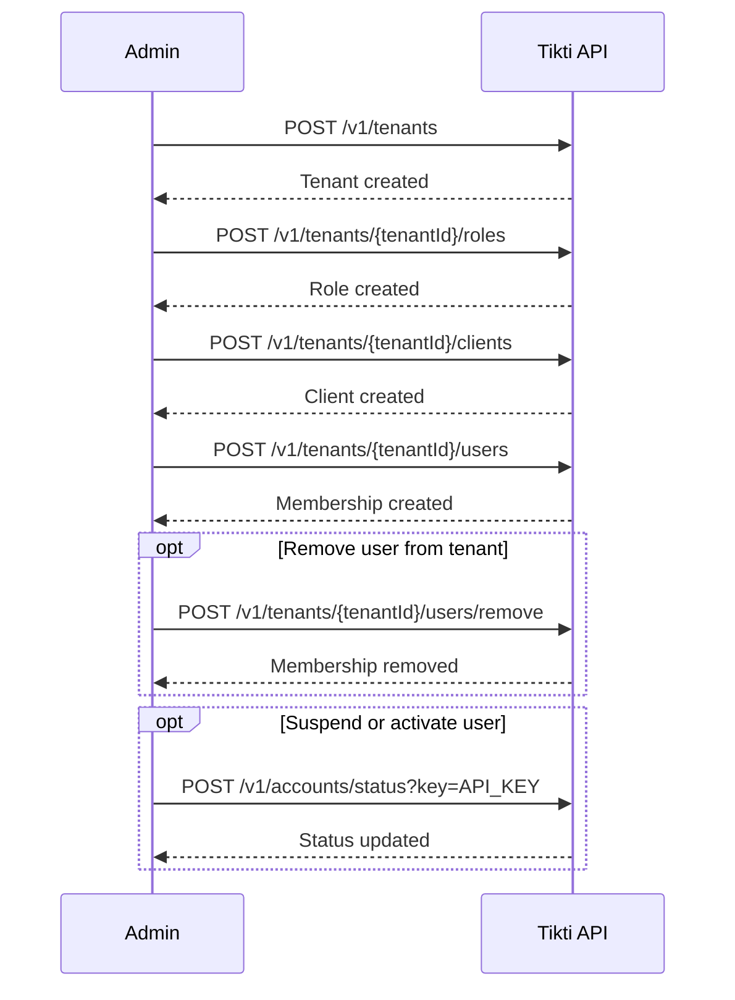

# Use Case: Tenant Admin Lifecycle

Manage tenant resources and memberships through admin operations.

## Actors

- Global admin or tenant admin
- Tikti API

## Preconditions

- Caller is authenticated and authorized for admin scopes.
- Target tenant exists for tenant-scoped operations.

## Main flow

1. Admin creates tenant (`POST /v1/tenants`) when needed.
2. Admin creates tenant roles (`POST /v1/tenants/{tenantId}/roles`).
3. Admin creates tenant clients (`POST /v1/tenants/{tenantId}/clients`).
4. Admin adds users to tenant (`POST /v1/tenants/{tenantId}/users`).
5. Admin may remove users (`POST /v1/tenants/{tenantId}/users/remove`).
6. Admin may suspend/re-activate users using account status operations.

### Sequence diagram

## Expected outcomes

- Tenant boundaries are enforced in every mutation.
- Role and client registries are deterministic and auditable.
- Membership changes are reflected in subsequent authorization decisions.

## Failure scenarios

- Non-admin caller -> operation denied.
- Invalid tenant identifier -> operation denied with contract error.
- Invalid role/scope payload -> validation error.

## Related specs

- [API Specification](API-Specification)
- [Multi-Tenant Authorization](Multi-Tenant-Authorization)
