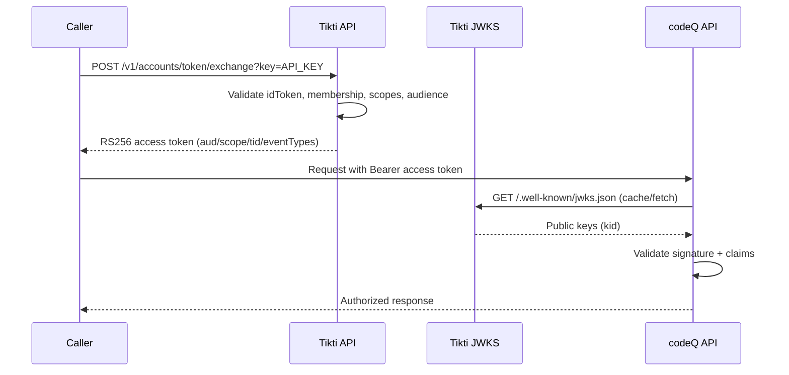

# codeQ Worker Token Exchange

Issue an RS256 access token for codeQ worker operations.

## Actors

- Authenticated user or service principal
- Tikti API
- codeQ worker/resource server

## Preconditions

- Caller has a valid identity token.
- Caller has membership and required permissions in target tenant.
- Target audience and scopes are allowed for requested client/resource.

## Main flow

1. Caller requests `POST /v1/accounts/token/exchange?key=API_KEY`.
2. Request includes target `aud`, requested scopes, tenant context, and optional `eventTypes`.
3. Tikti validates identity token, tenant membership, and scope policy.
4. Tikti issues RS256 access token with claims: `iss`, `aud`, `scope`, `tid`, `exp`, `iat`, and optional `eventTypes`.
5. Worker presents token to codeQ endpoints.
6. codeQ validates token signature and claims against JWKS and policy.

### Sequence diagram

## Expected outcomes

- Token is accepted only for matching audience and permitted scopes.
- Worker actions are constrained by declared scopes and event types.
- Cross-tenant escalation is blocked.

## Failure scenarios

- Missing membership for tenant -> exchange denied.
- Requested scope outside policy -> exchange denied.
- Audience mismatch at resource server -> request denied by codeQ.

## Related specs

- [codeQ Integration](codeQ-Integration)
- [Tokens and Keys](Tokens-and-Keys)
- [Multi-Tenant Authorization](Multi-Tenant-Authorization)
