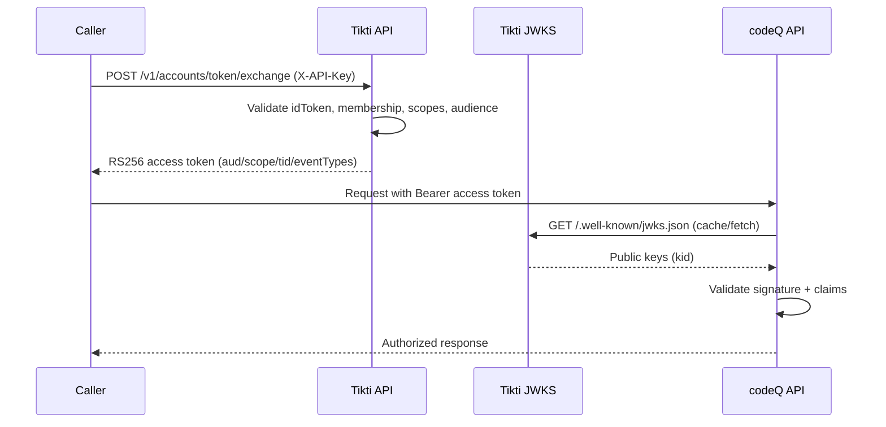

# codeQ Worker Token Exchange

Issue an RS256 access token for codeQ worker operations. The caller exchanges an HS256 idToken (obtained via password sign-in, OOB sign-in, or SAML SSO) for a scoped RS256 access token that codeQ validates offline through JWKS.

## Actors

- Authenticated user or service principal
- Tikti API
- codeQ worker / resource server

## Preconditions

The caller holds a valid idToken. The caller has a membership and the required permissions in the target tenant. The target audience and scopes are permitted for the requested client and resource.

## Main flow

1. Caller requests `POST /v1/accounts/token/exchange` with `X-API-Key: API_KEY`.
2. The request includes a target `aud`, requested scopes, tenant context, and an optional `eventTypes` claim.
3. Tikti validates the idToken, tenant membership, and scope policy.
4. Tikti issues an RS256 access token with claims: `iss`, `aud`, `scope`, `tid`, `exp`, `iat`, and optional `eventTypes`.
5. The worker presents the token to codeQ endpoints.
6. codeQ validates the token signature and claims against JWKS and its local policy.

### Sequence diagram

## Expected outcomes

The token is accepted only when the audience and scopes match the resource server policy. Worker actions are constrained to the declared scopes and event types. Cross-tenant escalation is blocked by `tid` enforcement.

## Failure scenarios

Missing membership for the target tenant: exchange denied.

Requested scope outside policy: exchange denied.

Audience mismatch at the resource server: request denied by codeQ.

## Related specs

- [codeQ Integration](codeQ-Integration)
- [Tokens and Keys](Tokens-and-Keys)
- [Multi-Tenant Authorization](Multi-Tenant-Authorization)
